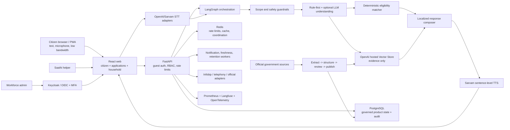

# Sahaayak

Sahaayak is a voice-first, multilingual public-service copilot for discovering
government schemes, scholarships, and reviewed job opportunities; explaining
why a person may or may not qualify; preparing documents and applications; and
routing unresolved cases to a verified human or government office.

It is designed for people who may prefer an Indian language, speaking over
typing, a low-bandwidth connection, or an assisted journey. Sahaayak provides
independent guidance and links to official sources. It does **not** issue a
government eligibility decision or replace an official application portal.

## What makes this system different

- **Structured eligibility, not model guesses.** Reviewed criterion JSON is
  evaluated by a deterministic matcher with passed, failed, and unknown
  evidence.
- **RAG with a narrow authority boundary.** A persistent OpenAI-hosted Vector
  Store supplies cited source discovery and explanation. It cannot publish a
  benefit or overrule the matcher.
- **One agent across text and voice.** Browser text, microphone/WebSocket audio,
  and the signed telephony seam all reach the same orchestration and policy
  path.
- **Discovery continues into action.** Benefit detail, compare/save/share,
  document checklists, application readiness/status, reminders, household
  recommendations, assisted mode, escalation, and verified-office routing are
  part of the product.
- **An operations control plane is built in.** Admins can inspect provenance,
  review/version/rollback data, resolve reports, manage escalations, see spend
  and freshness, stage feature flags, simulate provider failures, export audits,
  and compare deployments.
- **Safety fails closed.** Opaque guest tokens, Redis-backed rate limits,
  workforce OIDC/MFA, provider policy switches, scope guardrails, bounded input,
  redacted telemetry, retention jobs, and persistent provider-budget ledgers
  protect a public deployment.

## Current implementation status

| Area | Implemented baseline | External release gate |
| --- | --- | --- |
| Citizen discovery | Multi-turn scheme, scholarship, and job discovery; benefit detail; source/freshness; criterion evidence; feedback; compare/save/share | Broader active coverage requires human approval of sourced rows |
| Voice | Batch fallback and WebSocket streaming seam, VAD/barge-in behavior, editable transcript, sentence-level Sarvam TTS, text fallback | Real microphone/browser evidence per released language and provider keys |
| RAG | 2,069 indexed documents in one persistent hosted store; cited search/answer APIs; graph integration | Recheck source extraction and cost before materially expanding the corpus |
| Applications | Document tasks, governed fields/requirements, readiness, application pack, official handoff, provenance-aware status/outcome timeline | True downstream submission/status adapters require official provider access |
| Household Radar | Citizen OIDC/BFF seam, households/members, encrypted facts, member-scoped radar, life events, guest migration | Production citizen IdP, privacy policy, and risky dependant features must be activated deliberately |
| Assisted Saathi | Expiring invitations, scoped consent, helper redemption, citizen-confirmed actions, pause/revoke/complete and audit | Workforce/citizen identity and assisted-service operating policy |
| Human assistance | Claim/note/SLA/route/resolve escalation queue and governed district/pincode directory | Authoritative office records must be approved before active routing |
| Messaging/telephony | In-app reminders, consent/opt-out/delivery model, Infobip adapters/webhooks, signed generic telephony endpoint | Sender/template/carrier approvals, credentials, and provider-specific tests |
| Languages | English plus ten Indic language profiles, prompt/UI bundles, script fonts, validation tools, and staged activation controls | Native-speaker terminology, real voice, accessibility, and admin attestation for each released locale |
| Admin/operations | OIDC roles, overview, review/versioning, telemetry, providers, messaging, quality, flags, languages, audit, system/deployment/failure controls | Production hostname/TLS/MFA; external Langfuse/OTLP receipt; backup/restore evidence |

“Implemented baseline” means the code path and automated contracts exist. It
does not mean every external provider, language, state, or dataset is approved
for a public-service production claim.

## Trust boundary: matcher versus RAG

This separation is load-bearing:

```text
human-reviewed structured criteria -> deterministic matcher -> eligibility evidence
machine-extracted source corpus      -> hosted retrieval     -> cited explanation
```

The matcher can return likely match, failed criteria, or uncertainty caused by
missing facts. RAG can explain a scheme, retrieve application context, and show
source cards, but retrieved prose is treated as untrusted document data. It may
not invent a date, amount, requirement, or application step.

Machine-structured rows stay inactive until an authorized reviewer checks the
official source and publishes a version. Application assistance is blocked
unless the benefit is human-verified.

## Architecture



For an editable system-design version, open
[`docs/sahaayak-architecture.excalidraw`](docs/sahaayak-architecture.excalidraw).

## Main product journeys

### Citizen discovery and trust

1. The browser obtains an opaque guest session and one-time bearer token.
2. The person chooses language/state and types or speaks a request.
3. Scope checks reject unrelated or unsafe requests.
4. The agent identifies the service intent and gathers only missing facts.
5. The matcher evaluates active structured criteria.
6. The user receives cautious result wording, criterion evidence, uncertainty,
   source provenance, freshness, required documents, and next steps.
7. The user can report an error, save/share a result, or compare up to three.

### Voice

```text
microphone -> PCM/recorded audio -> STT -> editable transcript
-> same agent/matcher/RAG path -> localized text -> sentence-level TTS
```

The WebSocket path supports incremental audio, voice activity detection,
interruption, and transcript confirmation. A buffered upload remains the
compatibility fallback. Text always remains available if speech input/output is
disabled, budget-capped, or temporarily unavailable. Raw audio is not retained
by default.

### Application completion

A human-verified benefit can become an application workspace with:

- document/task checklist and reminders;
- governed fields and requirement evidence;
- complete/incomplete/ready-with-warning state;
- application-pack preview/print;
- official portal handoff;
- encrypted external reference number;
- citizen-reported versus provider-verified provenance;
- status history, action-required state, and final outcome.

### Household Benefits Radar

Authenticated citizens can create a purpose-limited household, manage authorized
member aliases, store masked/encrypted facts, and generate member-scoped
recommendations with criterion evidence. Life events can trigger a refresh.
Guest work can be migrated transactionally after sign-in. Minor/dependant
support remains separately gated.

### Assisted Saathi mode

Assistance uses an expiring, scoped invitation. A helper can see only approved
data categories and can only draft approved action types. The citizen confirms
before execution and may pause, revoke, or end the session. Actions are audited.

### Human handoff and office routing

Escalation tickets support claim, notes, SLA, resolution, and department routing.
Directory records include state/district/pincode coverage, service type, contact
details, supported languages, official source, verification state, approval,
version history, and rollback. Fallback rules identify uncertainty instead of
promising an unverified local office.

## Admin control center

The `/admin` console is role-aware (`observer`, `operator`, `reviewer`, `admin`)
and supports:

- aggregate health, usage, costs, quality, and readiness;
- redacted conversation/telemetry inspection;
- operator escalation claim, notes, SLA, routing, and resolution;
- benefit edit/review/approve/deactivate/version/rollback;
- incorrect-information report resolution;
- directory edit/approve/deactivate/version/rollback;
- provider health, budget, policy, circuit state, fallback, and dry-run failure
  simulation;
- messaging delivery/consent/opt-out visibility;
- import, RAG, source-freshness, and evaluation dashboards;
- language evidence, attestation, activation, and staged rollout;
- runtime feature flags with versions and rollback;
- audit browsing/export;
- deployment/schema comparison and explicit external release gates.

Raw sensitive profile data is not an admin observability feature. Admin telemetry
is redacted by default, and elevated access needs separate authorization and
audit.

## Technology stack

| Layer | Technology | Responsibility |
| --- | --- | --- |
| Web | React 19, TypeScript 7, Vite 8 | Citizen, application, household, assistance, and admin experiences |
| UI/accessibility | Tailwind CSS 4, shadcn-style primitives, Radix, Lucide, Noto script fonts | Responsive design system, semantic controls, Indian-script rendering |
| Frontend data/state | TanStack Router, TanStack Query, Zustand, Zod, IndexedDB | Typed routes, server cache, local state, runtime validation, offline drafts |
| Motion/PWA | Motion, Vite PWA | Reduced-motion-aware transitions, installable shell, offline/low-bandwidth behavior |
| API | Python 3.12, FastAPI, Pydantic | HTTP/WebSocket contracts, auth, rate limits, domain APIs |
| Agent | LangGraph, rule-first understanding, optional OpenAI reasoning | Reusable orchestration across text, voice, telephony, and messaging |
| Eligibility | Typed contracts + deterministic matcher | Criterion-level pass/fail/unknown evidence |
| Persistence | PostgreSQL, SQLModel/SQLAlchemy, Alembic | Governed product state, versions, consent, audit, migrations |
| Coordination | Redis + atomic Lua limiter | Shared rate limits, cache, worker coordination |
| Retrieval | OpenAI hosted Vector Store | Persistent embeddings/search and cited explanation |
| Speech | OpenAI/Sarvam STT adapters, Sarvam TTS | Indic voice input/output with budgets and fallbacks |
| Identity | Keycloak locally/self-hosted; standards-based OIDC/PKCE/BFF seams | Workforce roles/MFA and optional citizen identity |
| Messaging | Provider abstraction + Infobip adapters | In-app, SMS, WhatsApp, email, delivery, consent, opt-out |
| Operations | Docker Compose, Nginx, Caddy, Prometheus, Alertmanager | Reproducible runtime, TLS/proxy, metrics/alerts/backups |
| Tracing | structlog, Langfuse, OpenTelemetry | Redacted application, agent, and distributed telemetry |

## Repository map

| Path | Role |
| --- | --- |
| `apps/web` | React/PWA citizen and admin application |
| `packages/contracts` | Infrastructure-free Pydantic domain and API contracts |
| `packages/common` | Settings, database models, crypto, rate/provider policies, routing |
| `packages/api-types` | OpenAPI schema and generated TypeScript boundary types |
| `services/agent` | LangGraph, matcher, understanding, retrieval, language and voice adapters |
| `services/api` | FastAPI routes, browser/citizen/admin auth, workers, integrations, telemetry |
| `migrations` | Alembic schema history |
| `scripts` | Ingestion, review, RAG, jobs, directory, eval, retention, language and ops tools |
| `evals` | Deterministic multi-turn regression scenarios |
| `infra` | Python/web images, Nginx, Caddy, Keycloak, monitoring, backups |
| `tests` | 575 collected Python unit/API/integration/security regression tests |
| `docs` | Product specs, implementation roadmap, operations, and deployment guides |

## Prerequisites

- Python `>=3.12,<3.13`
- [`uv`](https://docs.astral.sh/uv/)
- Node.js 20+ and npm
- Docker Desktop/Engine with Compose for PostgreSQL, Redis, Keycloak, or the
  complete container deployment

Provider keys are optional for offline text/matcher development. They are
required for real hosted RAG and speech calls.

## Local quick start: native app with Docker data services

Install dependencies and create the ignored root `.env`:

```bash
make setup
docker compose up -d postgres redis
make migrate
make seed
make validate-data
```

The seed command preserves review status: machine-structured rows remain
inactive. Restore an approved database backup or publish source-verified rows
through the authorized admin workflow when active eligibility results are
required.

Start the API:

```bash
make api
```

In a second terminal, start the web app:

```bash
cp apps/web/.env.example apps/web/.env
make web
```

Open:

- citizen app: [http://localhost:5173](http://localhost:5173)
- API documentation: [http://localhost:8000/api/docs](http://localhost:8000/api/docs)
- API health: [http://localhost:8000/health](http://localhost:8000/health)
- readiness: [http://localhost:8000/readyz](http://localhost:8000/readyz)

The native quick start does not automatically start Keycloak. Configure a
local static admin token for isolated development, or use the complete Docker
test stack below for OIDC/MFA.

## Local complete stack: web, API, Keycloak, PostgreSQL, and Redis

Create `.env` and set strong local values for `POSTGRES_PASSWORD`,
`RATE_LIMIT_KEY_SALT`, `KEYCLOAK_ADMIN_USERNAME`, `KEYCLOAK_ADMIN_PASSWORD`, and
`KEYCLOAK_DB_PASSWORD`. For the Docker-built web app, also set:

```dotenv
VITE_ADMIN_OIDC_ISSUER=http://localhost:8080/realms/sahaayak
VITE_ADMIN_OIDC_CLIENT_ID=sahaayak-admin
VITE_ADMIN_OIDC_REDIRECT_URI=http://localhost:5173/admin/callback
VITE_ADMIN_ALLOW_MANUAL_TOKEN=false
```

Start the stack:

```bash
docker compose \
  -f docker-compose.production.yml \
  -f docker-compose.auth.yml \
  up -d --build
```

Apply migrations and import the structured catalog only if a prepared database
backup was not restored:

```bash
docker compose \
  -f docker-compose.production.yml \
  -f docker-compose.auth.yml \
  run --rm api python -m alembic upgrade head

docker compose \
  -f docker-compose.production.yml \
  -f docker-compose.auth.yml \
  run --rm api python scripts/04_seed_db.py
```

Open:

- citizen app: [http://localhost:5173](http://localhost:5173)
- admin console: [http://localhost:5173/admin](http://localhost:5173/admin)
- Keycloak: [http://localhost:8080](http://localhost:8080)
- API docs through the web proxy: [http://localhost:5173/api/docs](http://localhost:5173/api/docs)

In Keycloak, select the `sahaayak` realm, create a named user, assign only the
needed realm role, and enroll OTP. The bootstrap admin is for setup, not routine
workforce use.

If a URL gives an empty response, inspect health before repeatedly restarting:

```bash
docker compose \
  -f docker-compose.production.yml \
  -f docker-compose.auth.yml ps

docker compose \
  -f docker-compose.production.yml \
  -f docker-compose.auth.yml logs --tail=200 api postgres redis keycloak web
```

Keycloak cannot be reached if `docker-compose.auth.yml` was omitted.

## Configuration

Copy `.env.example` and enable only the integrations being tested. Important
groups are:

| Group | Important values |
| --- | --- |
| Core | `ENV`, `DATABASE_URL`, `REDIS_URL`, `WEB_BASE_URL` |
| Retrieval/LLM | `OPENAI_API_KEY`, `OPENAI_VECTOR_STORE_ID`, model/token/search limits |
| Speech | OpenAI/Sarvam keys, realtime STT switch, request reservations |
| Provider budgets | `OPENAI_BUDGET_USD`, `SARVAM_BUDGET_USD`, persistent ledger paths |
| Guest safety | route-specific minute/day limits, `RATE_LIMIT_KEY_SALT`, fail-closed/proxy settings |
| Workforce identity | admin OIDC issuer/discovery/JWKS/audience/roles/AMR and Vite OIDC build values |
| Citizen identity | OIDC/BFF issuer/client/token/cookie/encryption settings and Vite build values |
| Privacy | contact/application/profile/citizen encryption and hash keys, retention windows |
| Messaging/telephony/jobs | Infobip, signed telephony, NCS adapter switches and secrets |
| Observability | Langfuse, OTLP endpoints/headers/sample ratio, JSON logging |
| Deployment | database/Keycloak secrets, bind addresses, domains, ACME email, backup intervals |

Never prefix server secrets with `VITE_`; Vite values are compiled into browser
assets and are public configuration. Never commit `.env`.

## Hosted RAG and ingestion

The current hosted store contains:

- 2,066 exact-content-unique myScheme source documents;
- 3 UPSC recruitment source documents;
- 2,069 documents total, about 19.8 MB of normalized source text.

The manifest-driven sync is resumable and uploads only new content hashes:

```bash
uv run python scripts/07_sync_openai_vector_store.py --dry-run
uv run python scripts/07_sync_openai_vector_store.py
```

Do not run this for normal deployment. Set the existing
`OPENAI_VECTOR_STORE_ID`; the vector knowledge base is hosted and survives
Docker teardown.

The broader source workflow is:

```bash
make extract       # official/source download and raw extraction
make prefilter     # bounded candidate selection
make structure     # LLM-assisted typed criteria under a budget ledger
make spotcheck     # source comparison sample
make seed          # import while preserving human-verified rows
make validate-data # reject unsafe active rows
```

Publishing is a separate authorized admin action. Re-running ingestion cannot
overwrite a human-verified row with a machine-structured version.

See [`docs/rag-operations.md`](docs/rag-operations.md) and
[`docs/data-review-2026-08-02.md`](docs/data-review-2026-08-02.md).

## Government jobs and directory data

Job adapters cover reviewed UPSC/KPSC source workflows and an NCS adapter that
requires an authorized developer endpoint/key. Imported records stay inactive
until their notification, deadline, qualifications, reservation rules,
documents, and application URL are reviewed.

The department-directory pipeline can ingest official India.gov records and a
source-attested two-district Karnataka reference pack. Directory rows also remain
pending until approved; deterministic fallback routing never converts a guessed
office into a verified contact.

See [`docs/jobs-operations.md`](docs/jobs-operations.md) and
[`docs/department-directory-operations.md`](docs/department-directory-operations.md).

## Security, privacy, and cost controls

- Server-issued opaque guest session tokens; caller-provided IDs are not
  authorization.
- Per-session/per-IP minute and daily limits for text, voice, RAG, auth,
  applications, household/radar, assistance, messaging, and telephony routes.
- One atomic Redis window shared by API workers; production can fail closed.
- Workforce OIDC issuer/audience/signature/expiry/role/MFA validation; static
  admin tokens disabled in production.
- Citizen OIDC BFF option with HttpOnly cookies and encrypted server-side
  provider tokens.
- Purpose-limited household/assistance consent and owner-scoped queries.
- Independent encryption/hash keys for contacts, application references,
  profiles, and citizen identity joins.
- Scope guardrails and bounded text/audio/file/token inputs.
- Provider policies, circuit/fallback visibility, and persistent OpenAI/Sarvam
  code-level budget ceilings; `$5` is recommended for an initial public pilot.
- Redacted structured logs/traces/metrics; no raw voice retention by default.
- Retention dry run before execution, audit history, and provider failure drills.

Application ledgers are defense in depth, not billing guarantees. Configure
provider-side alerts/limits and monitor the account separately.

Read [`docs/security-operations.md`](docs/security-operations.md).

## Testing and quality

The repository currently collects **575 Python tests** across matcher/dialogue,
HTTP contracts, auth/authorization, rate limiting, budgets, providers,
applications, household/radar, assistance, directory, admin, voice, PWA support,
and integration seams.

```bash
make test                    # Python suite
make lint                    # Ruff; mypy remains advisory
make check                   # Ruff + pytest + production web build
make evaluate                # deterministic multi-turn regression set
make rate-limit-smoke        # cross-instance Redis limiter proof
make language-release-check  # prompt/review release gates
make language-ui-check       # scripts/fonts/accessibility/mobile evidence
make language-voice-smoke    # real provider call; budget-capped
npm run perf:web             # web build and bundle budget check
git diff --check
```

Real microphone, browser, native-language, external provider, OIDC redirect,
trace receipt, and accessibility checks remain human/deployment evidence even
when the code contracts pass.

## Deployment and architecture

- [`docs/free-deployment-guide.md`](docs/free-deployment-guide.md) compares
  current free hosts and provides the complete Oracle Cloud/Caddy/Keycloak
  deployment runbook plus a Northflank fallback.
- [`docs/sahaayak-architecture.excalidraw`](docs/sahaayak-architecture.excalidraw)
  is the editable system architecture diagram.
- [`docs/production-operations.md`](docs/production-operations.md) covers
  Compose, OIDC, backups, retention, monitoring, and limiter operations.

The public single-host overlay is started with:

```bash
docker compose \
  -f docker-compose.production.yml \
  -f docker-compose.auth.yml \
  -f docker-compose.oracle.yml \
  --profile workers \
  --profile ops \
  up -d --build
```

Do not use the public overlay until DNS, HTTPS hostnames, Keycloak redirect/logout
URIs, secrets, backups, provider budgets, and the deployment checklist are set.

## Documentation index

| Document | Purpose |
| --- | --- |
| [`docs/spec-v2.md`](docs/spec-v2.md) | Initial product/agent specification |
| [`docs/continuation-spec.md`](docs/continuation-spec.md) | Implementation history and acceptance context |
| [`docs/implementation-roadmap.md`](docs/implementation-roadmap.md) | Product, frontend, backend, infrastructure roadmap |
| [`docs/india-government-ui-ux-guide.md`](docs/india-government-ui-ux-guide.md) | India government-style UI, typography, accessibility, and motion guidance |
| [`docs/application-completion-status-copilot-spec.md`](docs/application-completion-status-copilot-spec.md) | Application lifecycle, provenance, adapters, privacy, and rollout |
| [`docs/household-benefits-radar-spec.md`](docs/household-benefits-radar-spec.md) | Household identity, facts, life events, matching, consent, migration |
| [`docs/low-bandwidth-pwa-assisted-mode-spec.md`](docs/low-bandwidth-pwa-assisted-mode-spec.md) | Offline/PWA and delegated Saathi architecture |
| [`docs/infobip-integration-plan.md`](docs/infobip-integration-plan.md) | Product-wide Infobip integration design |
| [`docs/infobip-operations.md`](docs/infobip-operations.md) | Sender, consent, webhook, retry, delivery and budget operations |
| [`docs/admin-operations.md`](docs/admin-operations.md) | Admin roles and operating workflows |
| [`docs/escalation-operations.md`](docs/escalation-operations.md) | Operator queue and SLA/routing operations |

## Release limitations

Do not describe the repository as nationally production-ready solely because the
features compile and tests pass. A real public-service release still requires:

- human-approved active benefits/jobs and authoritative directory records for
  each advertised geography;
- native-speaker terminology, voice, script, mobile, and accessibility evidence
  for every active locale;
- production OIDC hostnames, exact redirects/logout, roles, OTP/MFA, and session
  policies;
- activated provider credentials/approvals and webhook evidence where claimed;
- Langfuse/OTLP trace receipt, alert receiver, on-call ownership, and tested
  backup restoration;
- paid-capacity/SLA, privacy/legal/security review, and incident-response policy.

Sahaayak's control plane makes these gates visible so the product can expand
without hiding uncertainty.
