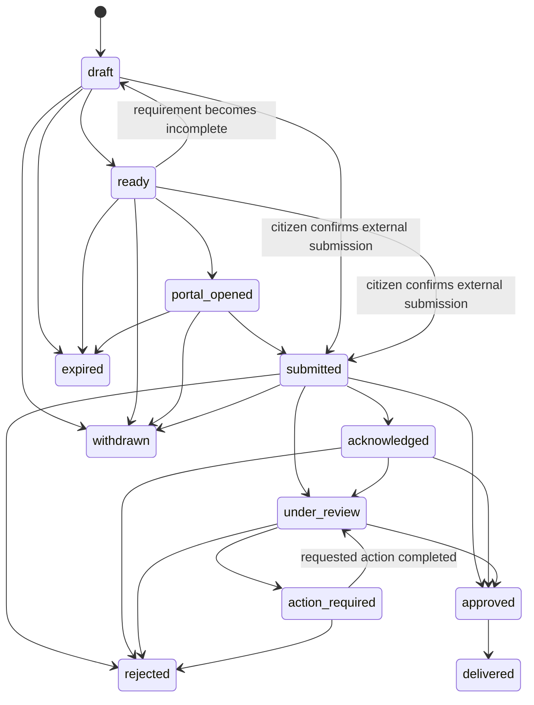

# Sahaayak Application Completion and Status Copilot — Product and Technical Specification

**Status:** implementation-ready proposal
**Priority:** P1 — recommended next product capability
**Document owner:** Product and Engineering
**Last updated:** 2026-08-09
**Depends on:** benefit governance, criterion evidence, saved benefits, application tasks, reminders, contact consent, guest-session authorization, department routing, operator escalation, audit events, feature flags, provider policies, and deployment telemetry
**Related documents:** [`spec-v2.md`](./spec-v2.md), [`implementation-roadmap.md`](./implementation-roadmap.md), [`india-government-ui-ux-guide.md`](./india-government-ui-ux-guide.md), [`infobip-integration-plan.md`](./infobip-integration-plan.md), [`production-operations.md`](./production-operations.md)

---

## 1. Executive summary

Sahaayak currently helps a citizen discover a scheme, scholarship, or government job; understand why it matched; inspect official evidence; save it; create a source-backed checklist; and schedule reminders. The checklist deliberately represents personal preparation and not an official application submission.

The Application Completion and Status Copilot closes the gap between discovery and outcome. It gives a citizen a safe workspace for preparing an application, reviewing known information, opening the correct official portal, recording an acknowledgement/reference number, following status changes, responding to missing-action requests, escalating when stuck, and reporting the final outcome.

This feature does **not** make Sahaayak a government application portal and does not imply that Sahaayak can submit or verify every application. Every status is labelled by provenance:

- **Citizen reported:** entered or confirmed by the citizen.
- **Operator verified:** checked by an authorized support operator against evidence supplied by the citizen.
- **Provider verified:** received from an approved government API or authenticated provider callback.

The system must never convert a citizen-reported status into an official status, scrape authenticated portals, bypass CAPTCHA, infer approval from a message, or claim a submission succeeded without authoritative confirmation.

### 1.1 Product outcome

The product should be able to measure a complete, honest funnel:

```text
Eligible result
  → application started
  → required fields/documents ready
  → official portal opened or assisted channel chosen
  → reference recorded
  → status followed
  → action request resolved
  → outcome reported or provider verified
```

### 1.2 Primary success metric

**Verified or citizen-confirmed completion rate:** percentage of started application cases that reach `approved`, `delivered`, `rejected`, or `withdrawn`, reported separately by status provenance.

The dashboard must not combine citizen-reported and provider-verified outcomes into one unlabeled number.

---

## 2. Existing implementation baseline

This specification extends existing code rather than replacing it.

| Existing capability | Current implementation | Reuse in this feature |
| --- | --- | --- |
| Guest authorization | Opaque browser bearer token; only its digest is stored | Authorize guest-owned application cases |
| Durable caller profile | `UserSession.profile` | Offer reviewable field suggestions; never silently submit them |
| Benefit governance | Approved/active benefits, versions, sources, freshness alerts | Snapshot the exact reviewed benefit version used to start a case |
| Eligibility explanation | Deterministic matcher and criterion-level evidence | Explain readiness; never use RAG/LLM to decide official eligibility |
| Saved benefits | `SavedBenefit` | Starting point for creating an application case |
| Application checklist | `ApplicationTask` with document/application-step tasks | Attach tasks to a case and preserve existing progress |
| Reminders | In-app and consent-gated external channels | Deadlines, action requests, and status follow-up |
| Contact points and consent | Encrypted destinations, verification, consent events, opt-out | Status notifications without exposing contact data |
| Operator escalation | Claims, notes, SLA, resolution, department routing | Help with blocked or overdue applications |
| Admin platform | OIDC/MFA, bounded roles, audit, provider policy, telemetry | Operate adapters and inspect aggregate completion health |
| Frontend stack | React, TanStack Router/Query, Zustand, Zod, Tailwind/shadcn, Motion | Add typed routes, queries, forms, state, and accessible transitions |

### 2.1 Confirmed gap

There is no first-class application record, acknowledgement/reference number, official-status provenance, immutable status history, application artifact, provider-status adapter, or outcome feedback model. Existing tasks explicitly stop at personal progress.

---

## 3. Goals and non-goals

### 3.1 Goals

1. Turn a reviewed benefit result into a structured application workspace.
2. Preserve the exact benefit revision, source, requirements, and deadline used when the citizen started.
3. Let the citizen review and correct suggested application fields before use.
4. Generate a portable application preparation pack without claiming that it is an official form.
5. Route the citizen to the correct official application channel.
6. Record reference numbers and status updates with explicit provenance.
7. Support provider-verified status only through authorized integrations.
8. Connect missing actions to tasks and reminders.
9. Escalate blocked cases to an operator or verified department directory entry.
10. Collect outcome feedback and expose privacy-safe funnel analytics.
11. Work across text and voice, with every consequential voice action requiring transcript review and confirmation.
12. Remain usable for anonymous guests while clearly explaining guest expiry and persistence limits.

### 3.2 Non-goals for the first release

- Universal direct submission to government portals.
- Browser automation, credential replay, CAPTCHA bypass, or scraping logged-in citizen pages.
- Storing Aadhaar numbers, portal passwords, OTP values, payment-card data, or unmasked identity documents.
- Treating an LLM or RAG response as proof of submission, eligibility, or approval.
- Replacing department grievance systems or legal appeal processes.
- Automatically appealing a rejection.
- Supporting payments in Sahaayak.
- Claiming DigiLocker support before requester onboarding and production approval are complete.
- Sharing a case with another person without a separate, explicit delegation design.

---

## 4. Users, jobs, and permissions

### 4.1 Citizen

Needs to:

- understand whether an application is ready;
- know which fields or documents are missing;
- avoid repeatedly entering the same facts;
- reach the official application channel;
- remember what was submitted and when;
- understand whether a status is self-reported or official;
- receive an accessible reminder when action is required; and
- obtain human help without retelling the complete story.

### 4.2 Assisted citizen

A citizen receiving help through Saathi Mode needs all the same protections plus visible disclosure of who is assisting, what the assistant can see, and which actions still require citizen confirmation. The assisted-mode contract is specified in [`low-bandwidth-pwa-assisted-mode-spec.md`](./low-bandwidth-pwa-assisted-mode-spec.md).

### 4.3 Operator

May inspect only the minimum case projection required for an assigned escalation, add a redacted note, route the case, record evidence-backed assistance, and resolve the ticket. An operator cannot mark a provider-verified status or read stored document contents by default.

### 4.4 Reviewer

Maintains benefit/application instructions and source-backed field mappings. A reviewer cannot access citizen cases merely because they can review public benefit content.

### 4.5 Administrator

Configures approved adapters, feature flags, retention policies, provider policy, and aggregate dashboards. Access to a specific citizen case must be exceptional, purpose-bound, audited, and unavailable to an observer role.

### 4.6 Observer

Can inspect aggregate, redacted operational metrics only. No application references, profile fields, document metadata, contact suffixes, or case notes are returned.

---

## 5. Product principles and trust rules

1. **Provenance before convenience.** Every value and status says who supplied it and when.
2. **Review before consequence.** Suggested fields, external navigation, application references, and state changes require confirmation.
3. **Official channel remains visible.** Show department, source URL, portal hostname, last verification date, and freshness state.
4. **No false integration.** A deep link is not called an integration; a submitted form is not called accepted; a citizen-entered status is not called official.
5. **Data minimization.** Collect only fields required by the selected benefit/application step.
6. **Sensitive values stay out of URLs, logs, traces, analytics, push payloads, and QR codes.**
7. **Immutable history.** Status changes are append-only events; correcting an error appends a correction event.
8. **Deterministic application logic.** LLMs may rewrite plain-language help but cannot invent fields, requirements, portal status, or deadlines.
9. **Graceful degradation.** If an adapter is unavailable, the official deep link, manual reference tracking, task list, and in-app reminders remain usable.
10. **Version awareness.** A case retains its starting benefit revision and identifies when current official instructions have changed.

---

## 6. End-to-end citizen journeys

### 6.1 Start an application from a benefit

1. Citizen opens an active, human-approved benefit detail page.
2. UI shows eligibility verdict, uncertainty, source, freshness, deadline, documents, and application channel.
3. Citizen selects **Start application**.
4. API verifies ownership, benefit availability, state/language rollout, and `application_copilot` feature flag.
5. Server creates one idempotent application case for the session/member/benefit unless the citizen explicitly starts a new attempt.
6. Server snapshots the current approved benefit version and materializes requirements.
7. UI opens the preparation step and announces how guest retention affects the case.

### 6.2 Prepare and review

1. The case displays required fields and documents grouped by application section.
2. Existing profile facts appear as **suggestions**, with source and last-confirmed date.
3. The citizen confirms, edits, or leaves each field blank.
4. Unsupported or uncertain mappings remain blank and explain why.
5. Readiness is calculated from required fields, document tasks, deadline, and unresolved eligibility uncertainty.
6. The citizen may generate a preparation pack or continue directly to the official portal.

### 6.3 Continue on an official portal

1. Sahaayak shows the official destination hostname and a leaving-Sahaayak notice.
2. Citizen confirms the external navigation.
3. The event `official_portal_opened` is recorded without adding profile data to the URL.
4. Sahaayak remains open with instructions for returning and recording the reference.
5. If an authorized deep-link adapter supports prefilled handoff, it sends only approved fields after a separate consent confirmation and logs the field names—not values—shared.

### 6.4 Record submission

1. Citizen selects **I submitted this application**.
2. UI asks for reference number, submission date, portal, and optional non-sensitive note.
3. Reference is masked during review and encrypted at rest.
4. Citizen confirms a summary.
5. Server appends `submitted` with `citizen_reported` provenance.
6. If an approved adapter later validates the reference, the server appends a separate `submitted` or current status event with `provider_verified` provenance. It does not rewrite the original event.

### 6.5 Track and respond

1. Timeline displays source, time, and confidence/provenance for each event.
2. An approved adapter may poll or receive a callback according to provider policy.
3. `action_required` creates or reopens a linked task and schedules an in-app reminder.
4. External reminders follow verified-contact, consent, template, budget, and opt-out gates.
5. A status unchanged beyond the configured service window offers escalation; it does not automatically accuse the department of delay.

### 6.6 Outcome and closure

1. Terminal status is `approved`, `delivered`, `rejected`, `withdrawn`, or `expired`.
2. Citizen can report whether the benefit/service was actually received.
3. For rejection, Sahaayak displays the official reason if supplied, source, and official appeal/grievance link where reviewed data provides one.
4. An LLM may summarize a provider-supplied reason, but the original authoritative text remains accessible.
5. Closing the case does not delete its audit/history; deletion follows the citizen retention workflow.

### 6.7 Voice journey

- The voice agent can say readiness, missing task titles, deadline, and latest status.
- It must not read full reference numbers, phone numbers, income, caste/category, disability, or document identifiers aloud by default.
- Any captured reference or status change is presented in the transcript editor.
- The citizen must confirm the edited transcript and then confirm the consequential action.
- DTMF/voice spelling of a reference is permitted only over an authenticated telephony session and must still use masked read-back.

---

## 7. Application lifecycle and state machine

### 7.1 Normalized statuses

| Status | Meaning | Terminal | May be citizen-reported | May be provider-verified |
| --- | --- | --- | --- | --- |
| `draft` | Case created; preparation incomplete | No | System-created | No |
| `ready` | Required local preparation checks pass | No | System-derived | No |
| `portal_opened` | Citizen followed the official application route | No | System-observed | No |
| `submitted` | Citizen/provider says the application was submitted | No | Yes | Yes |
| `acknowledged` | Receiving system issued an acknowledgement | No | Yes | Yes |
| `under_review` | Department/provider reports processing | No | Yes | Yes |
| `action_required` | Additional action or document is requested | No | Yes | Yes |
| `approved` | Application approved | Yes for decision | Yes | Yes |
| `delivered` | Benefit/service actually received | Yes | Yes | Yes |
| `rejected` | Application rejected | Yes | Yes | Yes |
| `withdrawn` | Citizen withdrew/stopped the attempt | Yes | Yes | Where supported |
| `expired` | Deadline/offer expired without completion | Yes | System-derived | Where supported |
| `unknown` | Provider response cannot be safely normalized | No | No | Yes |

`ready` is a Sahaayak preparation status, not an official government state.

### 7.2 Provenance

```text
system_derived
citizen_reported
operator_verified
provider_verified
```

Provider-verified events require an enabled adapter, successful authentication, replay protection, provider response hash, retrieval/callback timestamp, and adapter version.

### 7.3 Allowed transitions



Out-of-order provider events are retained but must not silently regress the displayed effective status. The reducer uses provider event time, provider sequence when available, provenance precedence, and transition validity. An admin-visible anomaly is created for incompatible events.

### 7.4 Effective status reducer

1. Load append-only events ordered by provider sequence when all events share that sequence domain; otherwise use `occurred_at`, then `recorded_at`, then event ID.
2. Discard no event; mark invalid transitions as anomalous.
3. Prefer a later provider-verified status over a citizen-reported status for the same application attempt.
4. Never allow a citizen event to overwrite a provider-verified terminal decision; it can add `delivered` feedback or a dispute note.
5. A corrected reference creates a new reference revision and triggers a new sync; it does not mutate old sync evidence.
6. Expose `effective_status`, `effective_status_source`, `effective_status_at`, and `has_conflict`.

---

## 8. Readiness logic

Readiness is deterministic and versioned.

### 8.1 Inputs

- required application fields from a reviewed application schema;
- required documents from the snapshotted benefit version;
- required application steps that must occur before portal handoff;
- unresolved eligibility criteria;
- benefit/application deadline;
- official application URL freshness and validity;
- state/language rollout status; and
- adapter availability only when that adapter is required for the chosen channel.

### 8.2 Output

```json
{
  "state": "not_ready | ready_with_warnings | ready | expired | unavailable",
  "blocking_items": [],
  "warnings": [],
  "completed_required": 7,
  "total_required": 9,
  "calculated_at": "ISO-8601",
  "rules_version": "application-readiness-v1"
}
```

### 8.3 Rules

- A missing required field or required document is blocking.
- An uncertain eligibility criterion is blocking unless policy for that benefit explicitly labels it as a post-submission verification.
- An optional field never blocks readiness.
- A stale source produces `ready_with_warnings` or `unavailable` according to governance policy; it never disappears silently.
- An expired deadline results in `expired` unless the official source explicitly says applications remain open.
- An unavailable adapter does not block manual official-portal handoff.
- Readiness must be recalculated when the benefit revision, application schema, tasks, facts, or deadline changes.

---

## 9. Data model

Use a new Alembic migration after `20260809_0019`. Exact revision naming is chosen when implementation begins.

### 9.1 `ApplicationCase`

| Field | Type | Notes |
| --- | --- | --- |
| `id` | string PK | Opaque generated ID |
| `session_id` | FK, nullable | Guest owner while session exists |
| `citizen_account_id` | FK, nullable | Future durable account owner; at least one owner is required |
| `household_member_id` | FK, nullable | Populated when Household Radar is enabled |
| `benefit_id` | FK | Canonical benefit |
| `benefit_revision` | integer | Exact public revision used at start |
| `benefit_snapshot` | JSON | Bounded public fields only: title, source, requirements, deadline, application URL |
| `attempt_number` | integer | Starts at 1; unique by owner/member/benefit/attempt |
| `effective_status` | enum string | Denormalized reducer result for efficient list views |
| `effective_status_source` | enum string | Provenance of current result |
| `effective_status_at` | datetime | Event occurrence time |
| `readiness_state` | enum string | Current deterministic readiness |
| `application_channel` | string | `official_portal`, `office`, `csc`, `post`, `other` |
| `provider_key` | string, nullable | Approved adapter key only |
| `external_reference_ciphertext` | text, nullable | Encrypted; never returned unmasked |
| `external_reference_hash` | string, nullable | Keyed hash for deduplication |
| `external_reference_masked` | string, nullable | Safe display suffix |
| `submission_date` | date, nullable | Citizen/provider supplied, with event provenance |
| `revision` | integer | Optimistic concurrency control |
| `retention_expires_at` | datetime, nullable | Derived from owner mode and policy |
| `created_at`, `updated_at`, `closed_at` | datetime | UTC |

Constraints:

- owner check requires `session_id IS NOT NULL OR citizen_account_id IS NOT NULL`;
- reference hash is unique only within provider/application scope where the provider contract guarantees uniqueness;
- no plaintext external reference column exists;
- public benefit snapshot excludes internal review notes and raw machine extraction.

### 9.2 `ApplicationStatusEvent`

Append-only event table:

- `id`, `application_case_id`;
- `status`, `provenance`;
- `occurred_at`, `recorded_at`;
- `actor_type`: `system`, `citizen`, `operator`, `provider`;
- `actor_id_hash` or workforce actor ID;
- `provider_event_id_hash`, `provider_sequence`;
- `adapter_key`, `adapter_version`;
- `reason_code`, localized-safe summary;
- `authoritative_text_ciphertext` only when retention is justified;
- `evidence_hash`, `source_url` where safe;
- `supersedes_event_id` for explicit corrections;
- `safe_metadata`; and
- `is_anomalous`, `anomaly_reason`.

Database permissions and application code must reject UPDATE/DELETE in normal workflows. Retention erasure replaces citizen-linked sensitive payloads while preserving a non-identifying aggregate event where legally and operationally permitted.

### 9.3 `ApplicationFieldDefinition`

A reviewed, versioned mapping between a benefit and its application fields:

- stable `field_key`;
- localized label/help;
- data type and validation rule;
- required/optional status;
- sensitivity class;
- source evidence excerpt and URL;
- profile-slot mapping, if any;
- allowed handoff destinations;
- review status, reviewer, revision, valid dates.

Only reviewed definitions may appear in a citizen application pack.

### 9.4 `ApplicationFieldValue`

- `application_case_id`, `field_key`, definition revision;
- encrypted value for confidential/restricted classes;
- non-reversible hash only where deduplication is needed;
- masked display;
- value source: `profile_suggestion`, `citizen_entered`, `digilocker`, `provider`;
- `confirmed_by_citizen_at`;
- expiry/reconfirmation date;
- revision and updated timestamp.

Do not store a value merely because it was displayed as a suggestion. Persistence begins after explicit confirmation.

### 9.5 `ApplicationRequirement`

Case-scoped snapshot of a required document or action:

- `requirement_key`, type, title, description, required flag;
- source benefit revision and evidence;
- status: `missing`, `ready`, `not_applicable`, `submitted`, `needs_update`;
- linked `ApplicationTask.id`;
- linked DigiLocker document metadata reference where authorized;
- expiry date where the source defines one.

Existing `ApplicationTask` gains nullable `application_case_id` and `requirement_key`. Existing saved-benefit tasks remain valid and are attached idempotently when the first case is created.

### 9.6 `ApplicationPackArtifact`

- case ID, format (`html`, `pdf`, `print`), locale;
- template/schema version;
- SHA-256 checksum;
- encrypted object-store key or short-lived generation token;
- created/expiry time;
- field names included and sensitivity summary, never field values in metadata;
- generation actor and consent event;
- download count and last download time.

Default behaviour is on-demand generation with no durable artifact. Production object storage is opt-in, encrypted, private, time-limited, and excluded from CDN/public caches.

### 9.7 `ApplicationStatusSyncAttempt`

Tracks every provider fetch without storing unrestricted raw payloads:

- case, adapter, operation, started/completed time;
- outcome, HTTP class, normalized provider error;
- request/response hashes;
- status found, provider event ID hash;
- latency and retry number;
- safe cost/quota metadata;
- next allowed sync time.

### 9.8 `ApplicationOutcomeFeedback`

- case;
- outcome: received/not_received/partially_received/unknown;
- citizen confirmation timestamp;
- optional structured reason code;
- free text either prohibited or encrypted with strict retention;
- satisfaction/helpfulness score optional;
- consent for product evaluation.

### 9.9 DigiLocker authorization records

Only implemented after partner approval:

- OAuth state digest, PKCE verifier ciphertext, nonce digest, requested scopes;
- access/refresh token ciphertext and expiry;
- citizen owner, case, and consent event;
- provider subject hash, never a display identity in telemetry;
- revoked time and last use;
- selected document URI hash and safe issuer/document type.

Tokens and document bytes must never be placed in `UserSession.profile`, browser local storage, logs, traces, or audit snapshots.

---

## 10. API design

All citizen routes require `require_browser_session` initially. Account-owned routes later accept a separate citizen account principal; code must not treat an admin OIDC token as citizen authorization.

### 10.1 Case APIs

| Method and path | Purpose | Important behaviour |
| --- | --- | --- |
| `POST /api/sessions/{session_id}/applications` | Start a case | Idempotency key required; snapshot approved benefit revision |
| `GET /api/sessions/{session_id}/applications` | List owned cases | Bounded pagination; masked references |
| `GET /api/sessions/{session_id}/applications/{case_id}` | Case detail | Includes readiness and redacted timeline |
| `PATCH /api/sessions/{session_id}/applications/{case_id}` | Update channel/date/reference | Requires expected revision and confirmation |
| `POST /api/sessions/{session_id}/applications/{case_id}/attempts` | Start a new attempt | Requires explicit reason; old attempt remains immutable |
| `POST /api/sessions/{session_id}/applications/{case_id}/withdraw` | Withdraw | Reversible only by creating a new attempt |
| `DELETE /api/sessions/{session_id}/applications/{case_id}` | Request deletion | Applies retention/erasure workflow; not a raw hard delete |

### 10.2 Field and requirement APIs

| Method and path | Purpose |
| --- | --- |
| `GET .../{case_id}/fields` | Return definitions, masked values, source and confirmation state |
| `PUT .../{case_id}/fields/{field_key}` | Validate and store one confirmed value with expected revision |
| `DELETE .../{case_id}/fields/{field_key}` | Remove a citizen value and recalculate readiness |
| `GET .../{case_id}/requirements` | Return documents/actions and linked task states |
| `POST .../{case_id}/requirements/{key}/status` | Confirm ready/not-applicable with reason rules |

Bulk field writes are avoided in the first release to reduce accidental overcollection and simplify correction/audit.

### 10.3 Status APIs

| Method and path | Purpose |
| --- | --- |
| `POST .../{case_id}/status-events` | Add a citizen-reported event after confirmation |
| `GET .../{case_id}/status-events` | Return safe immutable timeline |
| `POST .../{case_id}/sync` | Request provider status refresh; rate-limited and policy-gated |
| `POST .../{case_id}/outcome` | Record citizen outcome feedback |

Request payloads use Zod-generated/OpenAPI-aligned enums. Unknown provider statuses return `unknown` and retain safe diagnostics; they are never coerced to the closest optimistic state.

### 10.4 Pack APIs

| Method and path | Purpose |
| --- | --- |
| `POST .../{case_id}/packs/preview` | Render structured preview without durable storage |
| `POST .../{case_id}/packs` | Generate a short-lived downloadable artifact |
| `GET .../{case_id}/packs/{pack_id}` | Stream owner-authorized file with `Cache-Control: no-store` |
| `DELETE .../{case_id}/packs/{pack_id}` | Revoke and delete retained artifact |

Generation requires an explicit list of included field keys and returns a review summary before final creation.

### 10.5 DigiLocker APIs

Feature-flagged and unavailable until approved credentials exist:

- `POST .../{case_id}/digilocker/authorize`;
- `GET /api/integrations/digilocker/callback`;
- `GET .../{case_id}/digilocker/documents`;
- `POST .../{case_id}/digilocker/documents/{document_id}/attach`;
- `DELETE .../{case_id}/digilocker/authorization`.

OAuth uses authorization code with PKCE, exact registered redirect URI, state and nonce validation, single-use callback state, short token lifetime, and fail-closed configuration.

### 10.6 Provider webhooks

`POST /api/webhooks/applications/{provider}` must enforce:

- provider-specific signature or mTLS validation;
- timestamp tolerance and replay cache;
- body size limit;
- provider event idempotency;
- constant-time secret comparison;
- no guest bearer token;
- normalized event append followed by reducer execution; and
- minimal response information.

### 10.7 Error contract

Use stable codes such as:

- `APPLICATION_NOT_FOUND`;
- `APPLICATION_CONFLICT`;
- `BENEFIT_NOT_AVAILABLE`;
- `APPLICATION_SOURCE_STALE`;
- `REFERENCE_INVALID`;
- `STATUS_NOT_ALLOWED`;
- `ADAPTER_NOT_CONFIGURED`;
- `ADAPTER_RATE_LIMITED`;
- `PROVIDER_UNAVAILABLE`;
- `DOCUMENT_ACCESS_NOT_AUTHORIZED`;
- `PACK_EXPIRED`.

Citizen copy is localized and actionable. Internal provider details never cross the public API.

---

## 11. Government-provider adapter architecture

### 11.1 Interface

```python
class ApplicationProviderAdapter(Protocol):
    key: str
    version: str

    def supports(self, benefit: BenefitSnapshot) -> AdapterCapabilities: ...
    def validate_reference(self, reference: str) -> ValidationResult: ...
    async def fetch_status(self, request: StatusRequest) -> ProviderStatusResult: ...
    def official_deep_link(self, case: ApplicationCase) -> str: ...
```

Capabilities declare `deep_link`, `reference_validation`, `status_poll`, `webhook`, `prefill_handoff`, and `document_exchange` independently.

### 11.2 Initial adapters

1. **ManualOfficialPortalAdapter** — available for every reviewed benefit with an official application URL; no status verification.
2. **ServicePlusAdapter** — only after an authorized API or documented integration agreement exists. Public CAPTCHA pages must not be automated. Until then, provide the official tracking deep link and citizen-entered reference workflow.
3. **DigiLockerRequesterAdapter** — only after partner registration, credentials, redirect approval, scopes, testing, and go-live approval.

### 11.3 Adapter policy

Extend existing `ProviderPolicy` scopes with:

- enabled/disabled;
- rollout percentage and target states;
- poll interval and daily per-case limit;
- timeout, retry count, circuit-breaker threshold;
- cost ceiling;
- data fields permitted to leave Sahaayak;
- retention and raw-payload policy;
- adapter version and last verified date;
- rollback revision.

### 11.4 Sync scheduler

A separate worker claims due sync jobs using database row locking. It must:

- avoid polling terminal cases;
- use exponential backoff with jitter;
- obey provider `Retry-After`;
- pause through a circuit breaker;
- deduplicate by case/provider/reference/current window;
- prioritize `action_required` and user-requested refreshes;
- record safe telemetry; and
- leave manual tracking usable during outage.

---

## 12. Frontend information architecture

### 12.1 Routes

Add lazy TanStack routes:

```text
/applications
/applications/$applicationId
/applications/$applicationId/prepare
/applications/$applicationId/status
/applications/$applicationId/pack
```

Benefit detail gains **Start application**. The home page gains a compact **Your applications** summary, but the complete workflow belongs on dedicated routes rather than extending the existing long page.

### 12.2 Main screens

#### Applications list

- benefit name and domain;
- status plus provenance badge;
- next action and deadline;
- readiness progress;
- last update and stale-state warning;
- resume button;
- no unmasked reference.

#### Application overview

- trust header with official department/source;
- current status and provenance explanation;
- next best action;
- readiness summary;
- documents/tasks;
- official application channel;
- status timeline;
- reminders and human help;
- version/freshness change notice.

#### Prepare

- one logical section per page on mobile;
- visible required/optional labels;
- suggestion source and confirmation date;
- validation without clearing values;
- review screen before pack generation or handoff;
- save-and-exit notice tied to guest expiry.

#### Status

- status timeline with source labels;
- manual update form;
- refresh button only when an adapter is available;
- provider outage and last-success state;
- action-required tasks;
- escalation route;
- outcome feedback after terminal state.

### 12.3 TanStack Query and state

- Server state lives in TanStack Query; keys include session/account owner and case ID.
- Use mutations with idempotency keys and expected revisions.
- Invalidate case list, case detail, tasks, and reminders after relevant changes.
- Zustand may hold only transient wizard navigation, selected field IDs, and an unsubmitted review summary.
- Do not persist application values, references, provider tokens, or document metadata in Zustand storage/localStorage.
- Zod validates all API responses and discriminated unions.

### 12.4 Motion

- Use motion only for progress/state continuity.
- No celebratory animation for `approved`; it may be inappropriate or misleading before delivery.
- Respect `prefers-reduced-motion` and preserve equivalent status text.
- Timeline insertions must not steal focus.

---

## 13. Application pack specification

### 13.1 Pack contents

- independent Sahaayak identification and non-government disclaimer;
- benefit name, department, benefit revision, source URL, verification date;
- official application URL/office;
- citizen-confirmed field/value table;
- missing fields shown as blank, never guessed;
- document checklist;
- application steps and deadline;
- uncertainty/warning section;
- generated timestamp, locale, checksum, and expiry;
- QR code to an official URL or a short-lived Sahaayak resume URL with no PII.

### 13.2 Formats

- accessible HTML preview is canonical;
- printable HTML is required;
- tagged accessible PDF is a release gate before PDF is advertised;
- plain-text share summary for SMS/WhatsApp excludes sensitive values;
- no editable office document in v1.

### 13.3 Security

- `Cache-Control: no-store, private`;
- signed download URL lifetime no more than configured policy;
- no third-party analytics on pack routes;
- browser print styles hide controls and masked secrets;
- download filename contains no citizen name/reference;
- server-side PDF renderer has network access disabled except approved local assets;
- generated HTML is escaped and template-only; no arbitrary Markdown/HTML from RAG.

---

## 14. Benefit changes and source freshness

Each case keeps its original benefit snapshot. When the current approved benefit changes:

1. Compare deadline, application URL, documents, required fields, application steps, and eligibility criteria.
2. Show a categorized diff: `informational`, `action_required`, or `application_invalidated`.
3. Never rewrite the old snapshot or completed task history.
4. Create/reopen tasks only for newly required items.
5. Require citizen acknowledgement for material changes.
6. A stale/expired source triggers an admin alert and a citizen warning.
7. If application instructions are deactivated, preserve case history but disable new portal handoff until a replacement reviewed route exists.

---

## 15. Notifications and reminders

### 15.1 Trigger types

- application deadline approaching;
- preparation incomplete;
- status unchanged—follow-up suggestion;
- provider-verified status changed;
- action required;
- source/application instructions changed;
- DigiLocker authorization expiring/revoked;
- case retention expiry warning.

### 15.2 Rules

- In-app remains the guaranteed fallback.
- External delivery requires verified contact, purpose-specific consent, approved template, provider policy, feature flag, budget, quiet hours, and opt-out check.
- Status notifications reveal no benefit category or sensitive reason on a locked screen by default; use “Your Sahaayak application has an update.”
- Dedupe by case, trigger, effective status/event, channel, and policy window.
- A provider callback never sends a message synchronously; it enqueues a delivery.
- Consent withdrawal cancels future external delivery but preserves the consent/audit timeline.

---

## 16. Security, privacy, and retention

### 16.1 Data classification

| Class | Examples | Storage/display rule |
| --- | --- | --- |
| Public | benefit title, official source, generic requirements | Normal reviewed public storage |
| Internal | adapter health, anomaly reason, safe metrics | Workforce role restriction |
| Confidential | application reference, application fields, status reason | Encrypt at rest; masked UI; owner/operator-purpose access |
| Restricted | identity documents, Aadhaar-related data, disability/caste evidence | Do not store in v1; approved integration and separate controls required |

### 16.2 Encryption

Generalize the existing contact encryption pattern into a versioned field-encryption service:

- envelope encryption with deployment-managed key material;
- ciphertext plus key version;
- keyed hashes for narrow lookup/deduplication;
- safe masked projection;
- rotation job with progress/audit;
- startup/readiness failure when a required key is absent;
- never fall back to plaintext.

### 16.3 Authorization

- Case ownership is resolved server-side from the bearer principal.
- A path `session_id` or `case_id` never grants access by itself.
- Operator access requires an assigned escalation and least-privilege projection.
- Reviewer access is public-content only.
- Admin break-glass access, if added, requires MFA, reason, short duration, and dedicated audit event.
- Pack download tokens are single-purpose, owner-bound where possible, short-lived, and revocable.

### 16.4 Retention defaults

- Guest application case: expires with guest policy unless citizen explicitly extends within allowed limits.
- Draft field values: short retention, configurable; delete earlier on request.
- Closed application metadata: configurable minimum needed for citizen history; prompt before expiry.
- Provider raw payload: not retained by default; safe hash and normalized event only.
- Generated pack: ephemeral by default; maximum short-lived retention when requested.
- DigiLocker tokens/documents: shortest provider-compatible period; revoke/delete immediately on disconnect.
- Aggregate metrics: retain only after unlinking direct identifiers.

The implementation must be reviewed against the current Digital Personal Data Protection Act/Rules and organizational obligations before production. This document is an engineering specification, not legal advice.

### 16.5 Threats and controls

| Threat | Required control |
| --- | --- |
| Guessing another case ID | Server-owned principal and ownership query |
| Reference number exposure | Encryption, masking, no URL/log/trace inclusion |
| Duplicate submission/status event | Idempotency key and append uniqueness |
| Forged provider webhook | Signature/mTLS, timestamp, replay cache |
| Status spoofing | Visible provenance and adapter-only provider verification |
| Malicious pack content | Reviewed templates, escaped values, renderer isolation |
| Portal phishing | Reviewed allowlist, hostname disclosure, freshness checks |
| OAuth interception | PKCE, state, nonce, exact redirect URI, TLS |
| Operator curiosity access | Assignment-based projection and audit |
| LLM fabrication | Structured source-backed fields; no LLM state transitions |

---

## 17. Accessibility, language, and content requirements

- Follow [`india-government-ui-ux-guide.md`](./india-government-ui-ux-guide.md).
- Every route has a unique title, one H1, landmarks, breadcrumbs, and skip link.
- Status is expressed through text, icon, and semantics—not colour alone.
- Timeline uses a semantic ordered list, not an inaccessible visual-only stepper.
- Forms support keyboard, 320px reflow, 200% zoom, text-spacing overrides, and 44px targets.
- Error summary links to invalid fields; focus moves only after submission.
- Dates use locale-aware visible formatting and ISO values for machines.
- Reference numbers use `dir="ltr"` and readable grouping inside Indic-language pages.
- Voice and text use the same normalized status vocabulary and reviewed glossary.
- Provider-supplied text is displayed in its source language with a labelled translation, not silently replaced.
- Generated HTML/print/PDF has document language, heading structure, table headers, alt text, and logical reading order.
- Session timeout warns and offers extension/save choices without erasing entered data unexpectedly.

---

## 18. Admin and operational experience

### 18.1 New admin page: Applications

Add `/admin/applications` with role-aware, privacy-safe views:

- funnel by benefit/domain/state/language;
- cases by effective status and provenance;
- action-required and stale cases;
- median time between stages;
- adapter sync success, latency, quota, and cost;
- conflicting/out-of-order status anomalies;
- pack generation and expiry counts;
- outcome rate and unknown-outcome rate;
- escalation conversion and SLA;
- data deletion/retention queue health.

No dashboard chart may expose a cohort below the configured privacy threshold.

### 18.2 Adapter administration

- capability and configuration status;
- secret-free credential readiness;
- sandbox/production environment badge;
- last successful sync/webhook;
- status mapping version;
- provider policy and circuit breaker;
- dry-run fixture simulation;
- staged rollout and rollback;
- webhook verification status;
- runbook link.

### 18.3 Public-content review

Benefit review gains an **Application schema** tab:

- field definitions and evidence;
- required/optional state;
- profile mapping;
- document/application-step mapping;
- official URL allowlist;
- deadline and freshness;
- version diff and rollback.

Changing a schema requires reviewer approval and does not mutate active cases.

### 18.4 Audit events

Audit at minimum:

- schema approval/edit/rollback;
- adapter policy/configuration change;
- provider failure simulation;
- operator case access and mutation;
- break-glass access;
- pack generation/revocation;
- DigiLocker connect/revoke;
- deletion/retention action.

Audit snapshots contain identifiers and safe metadata, not field values, references, tokens, or document content.

---

## 19. Observability and evaluation

### 19.1 Telemetry events

- `application_case_started`;
- `application_readiness_calculated`;
- `application_portal_opened`;
- `application_status_recorded`;
- `application_status_sync_started/completed`;
- `application_status_conflict`;
- `application_pack_generated/downloaded/expired`;
- `application_action_required`;
- `application_outcome_recorded`;
- `application_escalated`;
- `digilocker_authorized/revoked/error`.

Attributes are bounded: domain, state, language, status, provenance, adapter, duration, outcome, error class, benefit revision, deployment revision. No case ID, profile value, reference, transcript, document name, contact, source free text, or provider raw body enters Langfuse/OpenTelemetry.

### 19.2 SLOs

- Case create/list/detail p95 under 500 ms excluding provider calls.
- Readiness calculation p95 under 250 ms for one case.
- Pack HTML preview p95 under 2 seconds; PDF generation handled asynchronously if slower.
- Status sync API acknowledges within 500 ms and queues work.
- Provider callback accepted/deduplicated within 1 second under normal load.
- No duplicate normalized events for the same provider event ID.
- 100% of displayed statuses include provenance.
- 0 unmasked references in logs, traces, analytics, URLs, or admin lists.

### 19.3 Product metrics

- result-to-start conversion;
- start-to-ready conversion;
- ready-to-submitted conversion;
- submitted-to-terminal-outcome conversion;
- median days and drop-off by stage;
- missing requirement frequency;
- citizen-reported versus provider-verified coverage;
- escalation and resolution rate;
- reminder effectiveness by consented channel;
- outcome/helpfulness score.

Use aggregate denominators and clearly label incomplete/unknown outcomes.

---

## 20. Infrastructure and deployment

### 20.1 New services

- `application-sync-worker`: claims status sync work; horizontally safe.
- Optional `artifact-worker`: produces PDFs in an isolated process.
- Object storage only if durable packs are enabled; production uses private managed object storage with encryption, lifecycle expiry, backup policy, and access logs. Demo may generate on demand without persistence.

### 20.2 Redis

Use Redis for:

- rate-limit windows;
- webhook replay keys;
- short OAuth state/PKCE correlation where durable recovery is unnecessary;
- provider circuit-breaker/cache state;
- short-lived pack download grants.

Redis is not the source of truth for application status.

### 20.3 PostgreSQL

- Append-only status events and immutable benefit snapshots are durable.
- Index owner/status/updated time, case/occurred time, due sync time, and provider event hashes.
- Use `SELECT ... FOR UPDATE SKIP LOCKED` for worker claims.
- Backups include new tables; restore drills verify events, references remain decryptable, and orphan artifacts are reconciled.

### 20.4 Configuration

Add secret-free settings for feature defaults, retention, sync intervals, object-store mode, allowed official hosts, and pack expiry. Provider credentials remain deployment secrets and appear in `/health` or admin release readiness only as booleans.

### 20.5 Feature flags

Add:

- `application_copilot`;
- `application_pack`;
- `application_status_sync`;
- `digilocker_requester`;
- `application_external_notifications`.

All use deterministic subject bucketing, state/language targeting, admin reason, revision, and rollback. Disabling sync never hides existing cases.

---

## 21. Rate limiting and abuse controls

Suggested independently configurable limits:

- start application: 10/hour/session;
- field mutation: 120/hour/session;
- status event: 20/hour/case and 60/hour/session;
- provider refresh: 3/hour/case plus provider daily ceiling;
- pack preview: 10/hour/session;
- PDF generation: 3/hour/case;
- DigiLocker authorization: 5/hour/session;
- outcome feedback: one active response per case with revision cooldown.

Limits use the existing Redis sliding-window approach and salted identifiers. Paid/provider operations reserve budget before invocation. A limit response explains when to retry and leaves read-only case access available.

---

## 22. Testing strategy

### 22.1 Unit tests

- allowed/invalid state transitions;
- effective-status reducer with out-of-order/conflicting events;
- readiness rules and benefit revision changes;
- reference normalization, masking, hashing, encryption, and rotation;
- field validation and sensitivity policies;
- adapter status mappings;
- pack field allowlist and escaping;
- reminder deduplication;
- feature-flag targeting;
- retention calculations.

### 22.2 API/integration tests

- ownership isolation across two guest sessions;
- expired/revoked token rejection;
- idempotent case creation and status events;
- optimistic concurrency conflict;
- provider webhook signature/replay/out-of-order behaviour;
- adapter timeout, retry, circuit breaker, quota and disabled state;
- task creation/reopening from `action_required`;
- consent/opt-out notification gates;
- source staleness and schema version diff;
- deletion and redacted audit output;
- generated OpenAPI/type drift.

### 22.3 Frontend tests

- complete start/prepare/review/handoff/status journey;
- manual status confirmation and provenance labels;
- reference masking;
- stale benefit/schema warning;
- provider outage fallback;
- guest expiry warning;
- keyboard-only and axe checks;
- 320px, 200%, reduced motion, forced colors, long translations;
- print and accessible pack HTML;
- no sensitive browser persistence.

### 22.4 Provider contract tests

- recorded sanitized fixtures in CI;
- sandbox smoke outside PRs;
- mapping test for every documented provider status;
- unknown status stays unknown;
- duplicate callback is harmless;
- provider date/time zone normalization;
- reference validation does not leak existence across owners.

### 22.5 Security tests

- IDOR/BOLA attempts;
- forged and replayed webhook;
- OAuth state/code replay;
- malicious field strings in HTML/PDF;
- official URL allowlist bypass/open redirect;
- cache header inspection;
- log/trace scan for synthetic secrets;
- operator role and assignment bypass;
- pack token theft/expiry/revocation.

### 22.6 Evaluation fixtures

Create deterministic cases for:

1. Scholarship prepared and citizen-reported submitted.
2. Scheme with missing income certificate and action-required transition.
3. ServicePlus-style reference with manual status only.
4. Provider callback arriving twice and out of order.
5. Benefit instructions changed after case creation.
6. Guest session expiry before submission.
7. Kannada voice status update requiring transcript correction.
8. Rejected application with official grievance link.

---

## 23. Delivery plan

### Phase 0 — contracts and safeguards

- Finalize status/provenance vocabulary and privacy review.
- Add public application field schema to benefit governance.
- Add feature flags and safe configuration.
- Define encryption key rotation and retention policy.

### Phase 1 — manual application workspace

- Migrations and case/event/field/requirement models.
- Case, field, requirement, manual-status, and outcome APIs.
- Dedicated citizen routes and task integration.
- Provenance-labelled timeline.
- Unit/API/frontend tests.

**Demo outcome:** a citizen starts a reviewed benefit, prepares it, opens the official link, records a masked reference, and follows a clearly citizen-reported timeline.

### Phase 2 — application pack and reminders

- Accessible HTML/print pack.
- Optional PDF worker after accessibility verification.
- Deadline/action/status reminder triggers.
- Benefit revision diff and source-staleness handling.
- Admin aggregate funnel.

### Phase 3 — authorized status adapters

- Adapter protocol and manual adapter.
- Sync worker, webhook ingress, policy/circuit breaker.
- First authorized government/provider integration.
- Failure simulation and operational runbook.

### Phase 4 — DigiLocker

- Complete partner onboarding and legal/security review.
- OAuth/PKCE and consent UX.
- Document metadata selection and minimum-retention attachment.
- Production sandbox/go-live evidence.

### Phase 5 — household and assisted integration

- Attach cases to household members.
- Cross-device account ownership.
- Saathi Mode consent and delegated assistance.

---

## 24. Acceptance criteria

### Product

- [ ] Citizen can start and resume an application case from an approved benefit.
- [ ] Existing application tasks are attached without duplication.
- [ ] Readiness explains every blocker and warning.
- [ ] Citizen can open the reviewed official channel and return safely.
- [ ] Citizen can record a masked reference and manual status after confirmation.
- [ ] Every status visibly identifies its provenance.
- [ ] A terminal outcome can be recorded and measured.

### Trust and data

- [ ] Exact starting benefit revision and source are retained.
- [ ] Changed application instructions produce a visible diff.
- [ ] No LLM output can mutate eligibility, readiness requirements, or status.
- [ ] No unapproved adapter can claim provider verification.
- [ ] Unknown provider status remains unknown.

### Security and privacy

- [ ] Ownership isolation, encryption, masking, rate limits, retention, and deletion tests pass.
- [ ] Reference/document/profile values do not appear in logs, traces, URLs, analytics, audit snapshots, or notifications.
- [ ] Provider webhooks and OAuth callbacks reject forgery and replay.
- [ ] Generated artifacts are private, short-lived, revocable, and non-cacheable.

### Accessibility and language

- [ ] Critical workflow passes automated accessibility checks and manual keyboard/screen-reader review.
- [ ] 320px, 200% zoom, text spacing, reduced motion, and long-locale tests pass.
- [ ] English, Hindi, and Kannada terminology is reviewed before activation.
- [ ] Voice consequential actions require transcript and action confirmation.

### Operations

- [ ] Admin can inspect aggregate funnel, adapter health, anomalies, retention queue, and audit events without sensitive data.
- [ ] Feature flags and provider policies have staged rollout and rollback.
- [ ] Backup/restore and multi-worker idempotency tests include application data.
- [ ] An adapter outage leaves manual tracking and official links available.

---

## 25. External dependencies and release gates

| Dependency | Code can be prepared | External gate before activation |
| --- | --- | --- |
| Official portal links | Yes | Human verification and freshness approval |
| ServicePlus status | Adapter seam only | Authorized API/integration agreement; do not automate CAPTCHA pages |
| DigiLocker | OAuth/client seam and disabled flag | Partner registration, agreements, client credentials, redirect URI, scopes, sandbox and go-live approval |
| SMS/WhatsApp/email | Existing delivery code | Infobip credentials, senders, approved templates, webhooks |
| Citizen durable account | Data/auth interfaces | Identity-provider and recovery decision |
| PDF artifact storage | Local ephemeral implementation | Private object storage, lifecycle, key management, accessible PDF validation |

Official references to re-verify during implementation:

- [ServicePlus](https://www.serviceonline.gov.in/)
- [DigiLocker requester onboarding](https://www.digilocker.gov.in/web/partners/requesters)
- [DigiLocker implementation model](https://www.digilocker.gov.in/web/implementation-model)
- [Digital Personal Data Protection Rules, 2025](https://www.meity.gov.in/documents/act-and-policies/digital-personal-data-protection-rules-2025-gDOxUjMtQWa)

---

## 26. Definition of done

The feature is code-complete when the manual application workspace, immutable provenance-labelled status history, readiness calculation, application pack, reminders, admin aggregates, security controls, migrations, documentation, and automated tests are merged and deployable with all external adapters disabled.

It is demo-ready when one reviewed benefit can complete the full manual journey with English/Kannada/Hindi text, a masked reference, a status timeline, a reminder, and an operator escalation without any false official-status claim.

It is production-ready only after privacy/security/accessibility review, production backup/restore evidence, provider-specific authorization and contract tests for every enabled adapter, reviewed templates and sources, real-language QA, and monitored staged rollout.
