# Sahaayak Household Benefits Radar — Product and Technical Specification

**Status:** implementation-ready proposal
**Priority:** P2 — high-value product differentiator
**Document owner:** Product and Engineering
**Last updated:** 2026-08-09
**Depends on:** deterministic eligibility matcher, reviewed benefits, guest sessions, citizen-facing localization, saved benefits, reminders, application cases, contact consent, feature flags, audit, OIDC-based workforce security, encryption/key management, and production retention controls
**Related documents:** [`spec-v2.md`](./spec-v2.md), [`implementation-roadmap.md`](./implementation-roadmap.md), [`application-completion-status-copilot-spec.md`](./application-completion-status-copilot-spec.md), [`low-bandwidth-pwa-assisted-mode-spec.md`](./low-bandwidth-pwa-assisted-mode-spec.md), [`india-government-ui-ux-guide.md`](./india-government-ui-ux-guide.md)

---

## 1. Executive summary

Sahaayak currently keeps one durable profile inside a guest `UserSession`. That is useful for a single caller, but citizens commonly look for schemes, scholarships, jobs, pensions, disability support, agricultural assistance, and other services for different members of the same household.

Household Benefits Radar adds an opt-in, account-protected household workspace. A citizen can create minimal profiles for themselves and people they are authorized to assist, choose who a conversation is about, record relevant life events, and receive source-backed recommendations and deadline alerts for each member.

The feature is intentionally more constrained than a general family database:

- Guest discovery remains available without an account.
- Persistent household profiles require a citizen identity and explicit consent.
- Names, exact dates of birth, caste/category, disability, income, and contact data are not collected unless needed for a selected task.
- The system does not infer relationships or sensitive facts.
- A household owner is not automatically authorized to submit official applications or view another adult's external records.
- Children and dependent adults require additional consent/guardian policies before production use.
- Eligibility remains deterministic and evidence-backed; RAG/LLMs do not decide eligibility.

### 1.1 Product outcome

The citizen should be able to answer “Who in my household may need attention now?” rather than repeating a new scheme search for every person.

```text
Create or select household member
  → confirm only relevant facts
  → run deterministic benefit matching
  → group opportunities by person and urgency
  → explain why matched/uncertain
  → save/start application
  → respond to life-event or deadline alerts
  → reconfirm stale facts
```

### 1.2 Primary success metric

**Actionable household coverage:** percentage of active household members with at least one current reviewed recommendation whose next action is viewed, saved, dismissed with a reason, or converted into an application case.

The metric is aggregate and must not expose household composition or sensitive attributes in analytics.

---

## 2. Existing implementation baseline

| Existing capability | Current state | Household extension |
| --- | --- | --- |
| `UserSession.profile` | One caller profile stored under guest ownership | Becomes a temporary discovery profile that may be selectively migrated |
| Guest token | Server-issued bearer, hash stored, expiry enforced | Continues for anonymous discovery; not sufficient for long-lived household access |
| Structured matcher | Rule-first eligibility and criterion evidence | Runs once per selected member using an explicit computed profile |
| Benefit governance | Active/human-reviewed rows and version history | Only approved/current benefits enter proactive radar results |
| Save/task/reminder | Session-owned benefits, tasks and reminders | Re-owned by citizen account/member where explicitly migrated |
| Application Copilot | Case can reference a future `household_member_id` | Household member becomes the subject of an application, not necessarily the logged-in person |
| Contact consent | Verified encrypted destinations and consent events | Household alerts remain tied to the account contact/consent, not to inferred member contacts |
| Languages/states | Runtime feature gates and release evidence | Radar runs only for released locale/state combinations |
| Admin | Redacted telemetry, audit and role-based access | Aggregate household health only; no browse-all-family console |

### 2.1 Confirmed gap

There is no citizen account model, household entity, member identity, field-level fact provenance, purpose/expiry model, life-event engine, member-scoped recommendations, member-scoped applications, or safe guest-to-account migration flow.

---

## 3. Goals and non-goals

### 3.1 Goals

1. Let a citizen manage separate, minimal profiles for authorized household members.
2. Make “who is this for?” an explicit conversation/application scope.
3. Avoid asking the same shared household fact repeatedly while allowing member-specific overrides.
4. Preserve provenance, confirmation time, purpose, sensitivity, and expiry for every fact.
5. Detect relevant life events and re-run reviewed benefit matching.
6. Present deduplicated, explainable opportunities by member, urgency, and confidence.
7. Connect recommendations to save, reminder, application, escalation, and outcome flows.
8. Keep household data private from workforce dashboards and other household members by default.
9. Support export, correction, selective deletion, full deletion, consent withdrawal, and retention expiry.
10. Work across text, voice, low-bandwidth, and assisted journeys with consistent safeguards.

### 3.2 Non-goals for the first release

- Building a legal family registry or proving legal relationships.
- Aadhaar-based family linking.
- Automatically inviting or sharing data with other adult household members.
- Joint ownership, custody disputes, guardianship adjudication, inheritance, or legal delegation.
- Inferring caste/category, religion/minority status, disability, gender, income, marital status, pregnancy, employment, or relationship from conversation context.
- Storing identity-document images.
- Cross-household social graphs.
- Household credit scoring, ranking, advertising, or sale of data.
- Sending one member's sensitive recommendation to another member without purpose-specific consent.
- Claiming a proactive recommendation is final eligibility.
- Activating a state/language whose reviewed benefits or locale evidence are incomplete.

---

## 4. Product principles

1. **One person, one explicit subject.** Every match, saved benefit, task, reminder, and application identifies its intended member.
2. **Shared does not mean universal.** Residence may be shared; age, education, disability, category, employment, and documents are member-specific.
3. **Ask only when useful.** Facts are collected in response to a visible benefit/life-event purpose, not to complete a maximal profile.
4. **No silent inheritance.** Shared facts are shown as inherited and can be confirmed or overridden.
5. **No sensitive inference.** Unknown remains unknown.
6. **Provenance and freshness.** Every fact has source, confirmer, confirmed time, and reconfirmation/expiry rule.
7. **Guest by default, account for persistence.** Discovery does not require sign-up; household storage clearly explains why sign-in is needed.
8. **Member privacy.** The account owner sees only what they are permitted to manage; workforce sees aggregates unless assigned a purpose-bound case.
9. **No notification surprise.** Alerts identify Sahaayak and an action category without exposing sensitive member details on a lock screen.
10. **Human-approved benefit data only.** Machine-extracted/unapproved rows never drive radar alerts.

---

## 5. Personas and authorization scenarios

### 5.1 Individual citizen

Creates a household containing only “Me.” This is the simplest durable profile and should not require adding fictional family structure.

### 5.2 Parent or guardian

Adds a child/dependant to discover scholarships or child benefits. Production activation requires a reviewed guardian consent and age policy. The system records the relationship as citizen-asserted, not legally verified, unless an approved external process verifies it.

### 5.3 Adult helping a parent

May create a minimal assisted profile for an older parent only after confirming authority/consent. This does not authorize access to the parent's external application records or DigiLocker.

### 5.4 Household facilitator

A CSC/NGO/frontline worker uses Saathi Mode. They do not become the household owner and cannot retain access after the assistance session. The citizen controls account creation and migration.

### 5.5 Workforce roles

- **Operator:** can see member alias and minimum routed facts only for an assigned escalation.
- **Reviewer:** reviews public benefit criteria and question wording; no household access.
- **Admin:** manages flags, policy, aggregate metrics, deletion failures, and system health; no routine profile browsing.
- **Observer:** aggregate redacted telemetry only.

---

## 6. Citizen identity and ownership model

### 6.1 Why a separate citizen account is required

The existing guest token is intentionally short-lived and browser-bound. A household profile is longer-lived, may include multiple people, and needs account recovery, cross-device access, security notifications, and explicit deletion. It must not be implemented by extending guest expiry indefinitely.

### 6.2 Authentication requirements

Implement a separate `CitizenPrincipal`; do not reuse workforce/admin OIDC roles. The citizen identity provider decision is deployment-specific, but the application contract requires:

- OAuth 2.0 Authorization Code with PKCE or a secure passwordless equivalent;
- verified phone/email or approved public digital identity provider;
- account recovery without exposing household membership;
- optional step-up authentication for export, adding an adult, DigiLocker, or sensitive deletion;
- short-lived access token and rotating/revocable refresh session;
- device/session list and remote sign-out;
- rate limits and anti-enumeration responses;
- exact redirect/logout allowlists and TLS in production.

For a demo, a local Keycloak citizen realm/client may be used, isolated from the workforce client and roles. Static citizen tokens are test-only.

### 6.3 Ownership rules

- One `CitizenAccount` owns zero or more households; v1 UI supports one active household.
- A `HouseholdMember` belongs to exactly one household.
- Every household has one owner account in v1.
- Adding another adult records asserted consent status; it does not give that adult login access.
- Shared/collaborative household ownership is deferred until invitation, revocation, dispute, and field-level access rules are designed.
- Guest sessions can be linked to an account only through a deliberate migration review.

---

## 7. Core citizen journeys

### 7.1 Guest discovery to household opt-in

1. Citizen uses Sahaayak anonymously.
2. After saving a benefit or asking for another family member, UI offers: **Keep this for my household**.
3. UI explains persistence, sensitive fields, account requirement, retention, and deletion.
4. Citizen can decline and continue as guest without losing the current supported journey.
5. If accepted, citizen authenticates and reviews a migration screen.
6. No guest data is copied until the citizen selects individual profile facts, saved benefits, reminders, and applications.
7. Migration appends provenance and deletes selected guest copies only after successful transaction/verification.

### 7.2 Create a household

1. Default household label is local and generic, such as “My household”; a surname is not required.
2. Citizen selects residence state/district and optional pincode only when routing/state matching needs it.
3. Citizen confirms shared facts individually.
4. Data-purpose notice appears immediately before income, category, disability, or precise location collection.
5. Household starts with one optional self member; citizen can use the account only for themselves.

### 7.3 Add a member

1. Choose relationship category: self, child, spouse/partner, parent, sibling, dependant, other.
2. Use a local alias such as “My daughter” or “Parent 1”; full legal name is optional and normally unnecessary.
3. Select age band or birth year first. Exact date of birth is collected only when a specific application requires it.
4. Show inherited shared facts and ask whether they apply.
5. Collect only a minimum starter set needed for requested domains.
6. Confirm authority/consent and visibility.
7. Run initial matching after explicit confirmation.

### 7.4 Start or switch a conversation subject

1. Home asks **Who are we checking for?** only when multiple members exist.
2. Selected member is displayed persistently near the conversation heading.
3. Switching member clears transient dialogue state and does not carry member-specific answers.
4. Shared facts remain available but visibly labelled.
5. Voice asks for confirmation when two aliases sound similar.
6. Every turn sent to the agent includes server-authorized `household_member_id`; client labels alone are insufficient.

### 7.5 View the radar

1. Dashboard groups cards by **Needs attention**, **New**, **Deadline soon**, **May qualify—answer needed**, **In progress**, and **Dismissed**.
2. Each card shows intended member, reason, uncertainty, source, freshness, deadline, and action.
3. One benefit relevant to three members appears as three member opportunities, not one ambiguous household match.
4. A household-level benefit is represented as one household opportunity with affected members identified only if the source supports that model.
5. Citizen can save, dismiss, snooze, compare, start an application, or request help.

### 7.6 Record a life event

1. Citizen selects a reviewed event type or describes it by voice/text.
2. The understanding layer proposes an event type and affected member.
3. Citizen reviews/edits both before storage.
4. Event definition declares required follow-up facts and benefit domains.
5. Matcher runs only after required confirmation.
6. New/changed opportunities are summarized without making eligibility guarantees.

### 7.7 Reconfirmation

1. When a fact expires or becomes stale, recommendations using it become `needs_reconfirmation`.
2. UI explains which fact, why it matters, last confirmation date, and alternatives.
3. Citizen confirms, updates, or removes it.
4. Re-matching creates a new recommendation snapshot; prior explanation remains in history.

### 7.8 Delete/export

- Delete one fact, member, life event, application linkage, or entire household.
- Show downstream effects before deletion.
- Adult/minor/dependant policy may require deleting or detaching applications separately.
- Export is a machine-readable and human-readable package with provenance and a warning about sensitive contents.
- Export requires recent/step-up authentication and is never emailed automatically.

---

## 8. Profile fact taxonomy and inheritance

### 8.1 Fact scopes

| Scope | Examples | Inheritance |
| --- | --- | --- |
| Household | state, district, rural/urban, shared annual household income | Suggested to members, explicitly confirmable/overridable |
| Member | age/birth year, education, occupation, disability, category, gender where relevant | Never inherited from another member |
| Application | exact legal name, exact DOB, certificate number, application-specific answer | Stays in application case; not promoted automatically |
| Session-only | temporary preference or unconfirmed conversational answer | Never persisted to household without confirmation |

### 8.2 Fact sensitivity

```text
public_preference
personal
confidential
restricted
```

- `public_preference`: locale, UI mode.
- `personal`: age band, district, education.
- `confidential`: exact DOB, household income, employment status.
- `restricted`: caste/category evidence, disability evidence, identity/document identifiers.

Restricted facts are not shown in generic admin surfaces, notifications, analytics, or offline stores. Exact documents remain outside v1 household storage.

### 8.3 Fact source

```text
citizen_entered
citizen_confirmed_suggestion
assisted_entry
application_derived_pending_confirmation
approved_provider
```

Facts derived from an application or provider do not become reusable profile facts without separate citizen confirmation and purpose notice.

### 8.4 Inheritance algorithm

For each matcher slot:

1. Use current, confirmed member override if present.
2. Else use a current, confirmed household fact only if its definition permits inheritance.
3. Else use no value.
4. Never fall back to another member's fact.
5. Emit `FactUseEvidence` identifying fact ID, scope, confirmation time, and inheritance state.
6. If fact is stale, pass it as unknown and generate a reconfirmation question rather than using it silently.

### 8.5 Reconfirmation defaults

Policy is configurable and reviewed. Suggested starting points:

- state/district/residence: 12 months or when citizen reports moving;
- income/employment: 6 months or relevant financial-year boundary;
- education/enrolment: academic-year boundary;
- age/birth year: derived continuously after confirmation;
- disability/category: no arbitrary expiry for status itself, but application evidence validity remains separate;
- contact/consent: follows existing verification and consent policy;
- life event: immutable occurrence plus correction event.

These are product defaults, not legal validity periods for official certificates.

---

## 9. Life-event engine

### 9.1 Initial event catalog

| Event key | Typical subject | Candidate domains | Minimum confirmation |
| --- | --- | --- | --- |
| `child_birth_or_adoption` | child/household | health, child welfare, identity services | event occurred, month/year, state |
| `school_admission` | child | scholarships, education support | level/class, institution type/state |
| `college_admission` | member | scholarships, loans, hostels | education level, enrolment mode |
| `graduation` | member | jobs, skills, fellowships | qualification and year |
| `job_loss` | adult | employment, insurance, skills | employment change and month |
| `new_job` | adult | employment services, welfare changes | employment type; avoid collecting employer unless needed |
| `disability_status_change` | member | disability support | explicit sensitive consent and status confirmation |
| `senior_age_threshold` | member | pension, health, concessions | birth year/age confirmation |
| `marriage_or_household_change` | household/member | benefits affected by household composition | explicit relevance notice |
| `relocation` | household/member | state/local schemes, routing | new state/district and effective date |
| `crop_loss_or_disaster` | member/household | agriculture, relief | location, event type/date, occupation |
| `death_in_household` | household | survivor/funeral support | highly sensitive confirmation and careful content |

Event copy must be reviewed by native speakers and content/privacy reviewers. Sensitive events are never used for celebratory or promotional language.

### 9.2 Event processing

```mermaid
flowchart LR
  A["Citizen describes or selects event"] --> B["Proposed structured event"]
  B --> C["Citizen reviews member, date and facts"]
  C --> D["Event stored with provenance"]
  D --> E["Affected matcher slots calculated"]
  E --> F["Reviewed benefits selected by state/domain"]
  F --> G["Deterministic eligibility evaluation"]
  G --> H["Recommendation snapshot and change set"]
  H --> I["In-app radar and consented reminders"]
```



LLM/rule-based understanding may propose an event, but nothing is stored or matched until the structured event is confirmed.

### 9.3 Trigger sources

- citizen-created/corrected life event;
- confirmed fact changed or expired;
- household/member added or removed;
- reviewed benefit activated, revised, deactivated, or approaching deadline;
- state/language feature rollout changed;
- scheduled age threshold reached;
- completed/rejected application outcome where another reviewed benefit may be relevant.

### 9.4 Trigger safeguards

- No more than one automatic rematch job per member/change batch.
- Dedupe by member, matcher profile version, benefit revision set, and rules version.
- A benefit does not notify repeatedly unless eligibility, deadline, source revision, or user state changed materially.
- Sensitive event types default to in-app only.
- New machine-extracted/unapproved benefits cannot trigger radar activity.

---

## 10. Recommendation model and ranking

### 10.1 Recommendation states

```text
new
viewed
saved
application_started
needs_information
needs_reconfirmation
snoozed
dismissed
expired
withdrawn_by_source
```

### 10.2 Recommendation generation

For each released state/member:

1. Select active, approved, fresh-enough benefits in enabled domains.
2. Build the member's explicit computed matcher profile.
3. Run the deterministic matcher.
4. Exclude `NOT_ELIGIBLE` from proactive alerts but retain it on direct queries with evidence.
5. Create/update a snapshot for `ELIGIBLE` and `UNDETERMINED`.
6. Store criterion evidence IDs and fact-use evidence, not a free-form LLM rationale.
7. Rank using deterministic features.

### 10.3 Ranking factors

Suggested bounded scoring:

- eligibility verdict (`eligible` before `undetermined`);
- approaching reviewed deadline;
- life-event relevance;
- source freshness/human verification;
- application already started;
- estimated number of missing answers/actions;
- citizen domain preference;
- prior dismissal/snooze state.

Do not use protected/sensitive attributes to reduce visibility except where the benefit's reviewed eligibility rule itself requires them. Do not rank by expected monetary value unless the source provides a comparable amount and product policy approves it.

### 10.4 Deduplication

- Same `benefit_id` + member = one active recommendation per benefit revision set.
- Central and state benefits with different IDs remain separate but may be grouped as alternatives.
- Renewals are linked to the prior application/benefit rather than shown as a new unrelated scheme.
- Jobs retain posting identity, closing date, and vacancy metadata; expired jobs are removed from active radar.

### 10.5 Explanation

Every recommendation returns:

- intended member alias;
- verdict and uncertainty;
- passed, failed, and unknown criteria;
- facts used, their scope, and last-confirmed date;
- missing answer questions;
- official source and last verification;
- deadline/freshness;
- whether triggered by a life event, fact change, benefit change, or direct search.

---

## 11. Data model

Use migrations after the application-copilot schema. Names below are stable design targets; exact migration IDs are assigned during implementation.

### 11.1 `CitizenAccount`

| Field | Type | Notes |
| --- | --- | --- |
| `id` | string PK | Internal opaque ID |
| `identity_provider` | string | Bounded provider key |
| `provider_subject_hash` | string unique | Keyed hash; no raw subject in analytics |
| `status` | string | active, locked, deletion_pending, deleted |
| `preferred_language_code` | FK | Released locale only |
| `timezone` | string | Defaults to Asia/Kolkata, validated allowlist |
| `terms_version`, `privacy_notice_version` | string | Accepted versions |
| `created_at`, `last_login_at`, `deletion_requested_at` | datetime | UTC |

Authentication sessions/tokens should live in a dedicated identity/session store, not this table as plaintext.

### 11.2 `Household`

- `id`, `owner_account_id`;
- optional localized label ciphertext or safe generated label;
- state/district/pincode fields only when confirmed;
- status and revision;
- matching policy version;
- retention policy/expiry;
- created/updated timestamps.

Pincode is confidential and encrypted/masked if stored. A normalized prefix may be retained only where routing requires it and policy permits.

### 11.3 `HouseholdMember`

- `id`, `household_id`;
- alias ciphertext plus a safe local ordinal (`member_1`) for logs;
- relationship category;
- `is_account_owner_subject`;
- `age_class`: child/adult/unknown;
- asserted authority/consent status and timestamp;
- status: active/archived/deletion_pending/deleted;
- revision and timestamps.

Do not require full legal name, gender, exact DOB, or phone number at creation.

### 11.4 `ProfileFactDefinition`

A code-owned or reviewed-table catalog:

- stable key and version;
- scope: household/member/application;
- data type, allowed values, validation;
- sensitivity class;
- allowed purposes/domains;
- inheritance permitted;
- default reconfirmation policy;
- localized question/help and glossary references;
- matcher slot mapping;
- review and activation status.

Changing a definition does not mutate old facts; it triggers migration/reconfirmation policy.

### 11.5 `ProfileFact`

- `id`, household/member owner;
- definition key/version;
- encrypted value where personal/confidential/restricted;
- safe normalized numeric/date projection only when necessary for matching and approved by security review;
- masked display representation;
- source and source reference;
- purposes consented;
- confirmed by account/assistance session;
- confirmed/valid-from/reconfirm-after/expires timestamps;
- status: current/stale/superseded/deleted;
- revision and timestamps.

Updates append a `ProfileFactRevision`; they do not overwrite provenance history.

### 11.6 `ProfileFactRevision`

Append-only before/after metadata with actor, action, reason, definition version, confirmation state, and timestamps. Audit-safe snapshots contain hashes/masks rather than confidential values.

### 11.7 `LifeEvent`

- `id`, household/member;
- event key/schema version;
- occurred date precision (`day`, `month`, `year`, `unknown`);
- encrypted structured attributes;
- provenance and citizen confirmation;
- status: active/corrected/deleted;
- supersedes event ID;
- affected domain list;
- created/updated timestamps.

### 11.8 `MemberRecommendation`

- `id`, household/member, benefit;
- benefit revision and matcher rules version;
- computed profile version/hash;
- verdict and state;
- deterministic score and reason codes;
- criterion evidence snapshot;
- fact-use evidence IDs;
- trigger type/reference hash;
- first/last generated, viewed, snoozed, dismissed times;
- dismissal reason code;
- linked saved benefit/application case;
- source deadline/freshness snapshot.

The snapshot contains no raw restricted values.

### 11.9 `HouseholdConsentEvent`

Append-only:

- account/household/member scope;
- purpose: persistence, personalization, proactive matching, external reminders, assisted access, member management, evaluation;
- action: granted/withdrawn/expired;
- notice version and locale;
- actor and assistance-session reference;
- timestamp and safe context.

Consent to one purpose does not imply another.

### 11.10 Ownership changes to existing models

Add nullable `citizen_account_id` and `household_member_id` where appropriate:

- `SavedBenefit`;
- `ApplicationTask` through `ApplicationCase`;
- `Reminder`;
- `ApplicationCase`;
- `EscalationTicket` safe subject reference;
- conversation context where durable account history is explicitly enabled.

During transition, each row is either guest-session-owned or citizen-account-owned. A check constraint prevents ownerless rows and application logic prevents ambiguous dual ownership outside a migration transaction.

---

## 12. Guest-to-account migration

### 12.1 Migration object

Create `GuestMigration` with:

- guest session and target account hashes;
- selected object IDs and field keys;
- requested/started/completed status;
- idempotency key;
- conflict report;
- source deletion status;
- timestamps and audit reference.

### 12.2 Transaction rules

1. Require a valid guest token and recently authenticated citizen account in the same flow.
2. Present a review list; default to no sensitive fact selection.
3. Create/choose a household member target.
4. Revalidate selected facts under household definitions.
5. Copy with `citizen_confirmed_suggestion` provenance and current notice version.
6. Merge saved benefits idempotently.
7. Re-own application cases only after conflict checks.
8. Recreate reminders only when contact/consent remains valid under the account.
9. Commit destination rows before marking source rows migrated.
10. Delete or detach guest copies according to policy; never leave two active reminders accidentally.

### 12.3 Conflict handling

- Existing current fact differs: show both masked/labelled values and require a choice.
- Same saved benefit: keep one and merge member-scoped task progress deterministically.
- Same benefit has active application: keep separate attempts until citizen chooses.
- Locale/state conflict: preserve account preference; member/residence facts remain explicit.

---

## 13. API design

All routes require `CitizenPrincipal` unless explicitly described as guest migration. IDs are resolved under account ownership in every query.

### 13.1 Account and household

| Method and path | Purpose |
| --- | --- |
| `GET /api/citizen/me` | Account projection, active household and sessions |
| `DELETE /api/citizen/me` | Start account deletion workflow |
| `POST /api/households` | Create minimal household |
| `GET /api/households/{household_id}` | Owner-safe household summary |
| `PATCH /api/households/{household_id}` | Update safe metadata with expected revision |
| `DELETE /api/households/{household_id}` | Review and request household deletion |
| `POST /api/households/{household_id}/export` | Create short-lived encrypted export |

### 13.2 Members

| Method and path | Purpose |
| --- | --- |
| `POST .../members` | Add minimal member after consent/authority confirmation |
| `GET .../members` | List safe aliases and attention counts |
| `GET .../members/{member_id}` | Member profile projection |
| `PATCH .../members/{member_id}` | Alias/relationship/status update |
| `DELETE .../members/{member_id}` | Impact review and deletion workflow |
| `POST .../members/{member_id}/select` | Set server-side active conversation subject |

### 13.3 Facts

| Method and path | Purpose |
| --- | --- |
| `GET .../facts` | Definitions plus current/stale/missing state; masked values |
| `PUT .../facts/{fact_key}` | Validate, purpose-confirm, and write one fact |
| `POST .../facts/{fact_key}/confirm` | Reconfirm unchanged fact |
| `DELETE .../facts/{fact_key}` | Remove fact and recalculate affected recommendations |
| `GET .../facts/{fact_key}/history` | Citizen-readable provenance and revisions |

One-fact writes are preferred over bulk profile blobs.

### 13.4 Life events and radar

| Method and path | Purpose |
| --- | --- |
| `POST .../life-events` | Store confirmed structured event |
| `GET .../life-events` | List redacted/localized events |
| `PATCH .../life-events/{event_id}` | Append correction event |
| `DELETE .../life-events/{event_id}` | Remove and rematch |
| `GET .../radar` | Household/member opportunity feed |
| `POST .../radar/recalculate` | User-requested bounded rematch |
| `POST .../recommendations/{id}/view` | Mark viewed idempotently |
| `POST .../recommendations/{id}/snooze` | Snooze to bounded date |
| `POST .../recommendations/{id}/dismiss` | Structured dismissal reason |
| `POST .../recommendations/{id}/restore` | Restore dismissed item |

### 13.5 Migration

- `POST /api/sessions/{session_id}/migration/preview` requires guest and account proofs;
- `POST /api/sessions/{session_id}/migration` creates idempotent migration;
- `GET /api/citizen/migrations/{migration_id}` returns safe status/conflicts.

### 13.6 Conversation changes

Text and voice turn requests gain optional `household_member_id`. The API:

1. resolves account/guest principal;
2. validates member ownership and active status;
3. computes a matcher profile server-side;
4. sets member-safe dialogue state namespace;
5. returns member alias and fact-use evidence in the response;
6. rejects a client-provided profile blob for account-owned matching.

### 13.7 Error codes

- `CITIZEN_AUTH_REQUIRED`;
- `HOUSEHOLD_NOT_FOUND`;
- `MEMBER_NOT_FOUND`;
- `MEMBER_CONSENT_REQUIRED`;
- `FACT_NOT_ALLOWED_FOR_PURPOSE`;
- `FACT_RECONFIRMATION_REQUIRED`;
- `PROFILE_CONFLICT`;
- `MIGRATION_CONFLICT`;
- `RADAR_RECALCULATION_PENDING`;
- `HOUSEHOLD_DELETION_BLOCKED`;
- `STEP_UP_AUTH_REQUIRED`.

Errors are non-enumerating and localized.

---

## 14. Frontend information architecture

### 14.1 Routes

```text
/household
/household/setup
/household/members/$memberId
/household/members/$memberId/facts
/household/life-events
/household/radar
/household/settings
/household/export
/account/security
```

### 14.2 Global member switcher

- Appears only after household/account activation.
- Shows a safe alias, not sensitive attributes.
- Available in home, benefit detail, saved, application, and radar routes.
- Change is explicit and announced to assistive technology.
- Route state/deep links include member ID only after server ownership check.
- Switching does not automatically replay the previous query for another member; citizen confirms.

### 14.3 Household home

Prioritize:

1. urgent actions/deadlines;
2. member cards with opportunity/application counts;
3. stale fact/reconfirmation requests;
4. recent life events;
5. privacy/settings/export/delete.

Do not use a social-media family-tree visualization. A simple list/card structure is more accessible and reveals less information while screen sharing.

### 14.4 Member profile

- Group facts by purpose, not bureaucratic data category.
- Show current, inherited, stale, missing, and overridden labels.
- Explain why each fact may help and which recommendations currently use it.
- Offer correction/removal beside the fact.
- Restricted facts require a reveal action and are masked by default.
- Do not show “profile completion percentage”; it encourages unnecessary collection.

### 14.5 Radar

- Filters: member, domain, urgency, verdict, state, saved/application state.
- Default order: action required, deadline soon, eligible/new, needs information, others.
- Cards expose reason and uncertainty inline.
- Dismiss/snooze controls are reversible.
- Empty state explains whether no reviewed benefit matched, facts are insufficient, or rollout is unavailable.

### 14.6 State management

- TanStack Query owns households, members, facts, events, recommendations, applications.
- Zustand holds only active local member selection and transient form/wizard state.
- Do not persist fact values in localStorage/sessionStorage.
- Account/access tokens use secure deployment-approved storage; prefer HttpOnly secure same-site cookies where the chosen citizen IdP/BFF architecture supports them.
- Zod schemas reject unknown sensitivity/provenance/status enums rather than displaying them optimistically.

---

## 15. Voice and multilingual behaviour

### 15.1 Subject disambiguation

- Voice starts with the active member: “We are checking for Parent 1.”
- Similar aliases trigger a numbered/text confirmation.
- The assistant never guesses a member from age/gender/context.
- A subject switch cancels the current slot-filling question and starts a member-scoped state.

### 15.2 Sensitive facts

- Ask why the fact is needed before the question.
- Offer “skip” and explain the effect.
- Do not read back full restricted values.
- Transcript editor and second confirmation apply before persistence.
- Background/assisted mode displays a privacy warning before speaking sensitive questions aloud.

### 15.3 Localization

- All relationship labels, life events, fact questions, explanations, status terms, consent notices, alerts, and delete/export flows live in typed reviewed locale catalogs.
- Transliteration is not an acceptable substitute for native-script review.
- Member aliases retain citizen-entered script.
- Mixed-script aliases and reference numbers use correct language/`dir` spans.
- A language can use Household Radar only after its locale release gate includes these new bundles and native-speaker evidence.

---

## 16. Notifications

### 16.1 Alert categories

- new reviewed opportunity;
- deadline soon;
- fact needs reconfirmation;
- application needs action;
- life-event follow-up;
- benefit source changed/deactivated;
- household security/account change;
- retention/deletion/export ready.

### 16.2 Privacy rules

- In-app is default.
- External notification requires account-level verified contact and purpose consent.
- Lock-screen copy does not name a disability, caste/category, income status, death event, pregnancy, or specific sensitive benefit.
- The message may say “A household item needs your attention in Sahaayak.”
- Citizen can choose per-purpose channel, quiet hours, digest frequency, and opt-out.
- One digest should combine low-urgency opportunities without listing sensitive member details externally.
- Never send a child's data to a phone/email asserted for that child unless separately verified and approved.

---

## 17. Security, privacy, consent, and safety

### 17.1 Purpose limitation

Each fact write includes at least one allowed purpose:

```text
benefit_matching
application_preparation
deadline_reminders
department_routing
assisted_support
product_evaluation_optional
```

Analytics is never implied by personalization consent. Withdrawing proactive-matching consent stops radar recalculation/alerts but does not force deletion unless requested.

### 17.2 Minor/dependant release gate

Before production profiles for children or dependent adults:

- legal/privacy review of guardian consent and applicable DPDP Rules;
- age-assurance approach that does not overcollect;
- clear authority assertion and correction route;
- restricted external sharing;
- no direct behavioural analytics/profiling beyond service matching;
- incident and deletion procedures;
- native-language guardian notice;
- usability review with safeguarding experts.

Until this gate passes, the feature flag may allow only a self profile in production while demo fixtures exercise the schema.

### 17.3 Encryption and key separation

- Use a general envelope-encryption service, not the Infobip contact key, for profile facts.
- Separate logical keys/key versions for profile facts, aliases, pincode, application references, exports, and provider tokens.
- Keyed hashes use dedicated salts and never a shared default string.
- Production startup/readiness fails closed if required keys are absent.
- Key rotation is observable, resumable, and tested against backups.

### 17.4 Authorization controls

- Server resolves household membership on every request.
- Account ID, household ID, member ID, recommendation ID, and application ID are all untrusted path inputs.
- No admin endpoint returns raw household facts by default.
- Operator projection is generated from an assigned escalation's allowed fields.
- Assisted access uses a separate short-lived assistance grant.
- Step-up authentication protects export, account deletion, adding an adult, changing recovery contact, and connecting external document providers.

### 17.5 Threat model

| Threat | Control |
| --- | --- |
| IDOR between accounts/households | Owner-scoped database queries and negative tests |
| Shared-device exposure | Masking, idle lock, remote sign-out, no local sensitive cache |
| Abusive household owner | Minimal data, adult sharing deferred, consent/authority states, correction/deletion route |
| Sensitive inference by LLM | Structured confirmed facts only; unknown remains unknown |
| Notification disclosure | Generic lock-screen copy and purpose/channel controls |
| Operator overreach | Assignment-based projection, MFA, audit, no browse-all endpoint |
| Guest migration theft | Simultaneous guest proof + recent account auth + review + idempotency |
| Profile poisoning | Provenance, confirmation, revisions, anomaly/rate checks |
| Recommendation discrimination | Deterministic reviewed rules, criterion evidence, evaluation by group without exposing individuals |
| Export leakage | Step-up auth, encryption, short expiry, no email attachment |

### 17.6 Retention

- Account and household retention is policy/versioned and disclosed.
- Unconfirmed suggestions expire quickly and are not profile facts.
- Stale facts remain visible for correction but are excluded from matching.
- Deleted fact ciphertext is erased; a safe audit tombstone may remain.
- Archived member recommendations expire according to evaluation/appeal needs.
- Exports and assistance grants expire quickly.
- Full account deletion is asynchronous, visible, retryable, and covers database rows, object storage, caches, search indexes, provider tokens, and notification queues.

Review current [Digital Personal Data Protection Rules, 2025](https://www.meity.gov.in/documents/act-and-policies/digital-personal-data-protection-rules-2025-gDOxUjMtQWa) and organizational obligations before activation, particularly for children and dependent adults. This is not legal advice.

---

## 18. Admin and operational controls

### 18.1 Household Radar admin dashboard

Privacy-safe aggregates only:

- accounts/households/members by active/deletion state;
- self-only versus multi-member adoption;
- radar runs, duration, queue depth, failures;
- recommendations by domain/verdict/state/language;
- view/save/dismiss/application conversion;
- stale fact and reconfirmation rates by fact definition—not value;
- life-event processing by event type only above privacy thresholds;
- external notification consent/delivery aggregate;
- deletion/export job health;
- access-denied and anomaly counts;
- active schema/engine/deployment version.

### 18.2 No raw-profile explorer

The admin console must not add a page that lists citizen names, household aliases, compositions, facts, or recommendations. Troubleshooting uses:

- salted case/account correlation supplied by the citizen;
- safe request/trace ID;
- synthetic replay fixture;
- redacted event metadata;
- time-bound break-glass only if separately approved.

### 18.3 Fact-definition governance

Admin/reviewer controls:

- add/edit/deactivate fact definitions;
- source/purpose/sensitivity/inheritance review;
- locale-copy readiness;
- matcher-slot mapping validation;
- reconfirmation policy;
- revision history and rollback;
- impacted recommendation estimate before activation.

### 18.4 Life-event governance

- event schema and localized content review;
- affected domains and required facts;
- sensitive-event notification policy;
- staged state/language rollout;
- synthetic preview;
- version diff and rollback.

### 18.5 Feature flags

Add:

- `citizen_accounts`;
- `household_profiles`;
- `household_multi_member`;
- `household_minor_profiles`;
- `life_event_radar`;
- `household_external_alerts`;
- `household_assisted_access`.

Rollout is deterministic by citizen account, with state/language targets and rollback. A disabled flag preserves export/delete access.

---

## 19. Matching and RAG integration boundaries

### 19.1 Deterministic matcher

The eligibility matcher receives a computed member profile with provenance. It remains the only component producing criterion verdicts.

### 19.2 RAG

RAG may:

- retrieve relevant approved/public source passages;
- answer “what does this requirement mean?”;
- summarize application steps with citations;
- explain uncertainty in the active locale;
- help identify a possible life-event intent before confirmation.

RAG may not:

- read the entire household profile when only one fact is needed;
- decide relationship/consent;
- invent a fact;
- change matcher verdict;
- persist a life event;
- choose a notification recipient;
- decide official application status.

### 19.3 Prompt/data minimization

Send only selected member facts needed for the current question, with abstracted values where possible. Never include household aliases, account identifiers, contact points, application references, or unrelated member facts in LLM requests.

---

## 20. Observability and evaluation

### 20.1 Safe telemetry

Events:

- `household_created/deleted`;
- `household_member_created/archived/deleted`;
- `profile_fact_confirmed/reconfirmed/removed/stale`;
- `life_event_confirmed/corrected/removed`;
- `radar_run_started/completed`;
- `recommendation_created/state_changed`;
- `guest_migration_started/completed/conflicted`;
- `household_export_requested/completed/expired`;
- `household_consent_changed`.

Safe attributes: state, language, domain, fact definition key, event key, verdict, trigger type, duration, count, error class, engine version, deployment revision. Exclude values, aliases, member/account/household IDs, free text, document metadata, contact data, transcript, and application reference.

### 20.2 SLOs

- Household/member/fact API p95 under 500 ms.
- Member profile computation p95 under 100 ms.
- Synchronous radar request acknowledges/returns current snapshot under 750 ms; expensive rematch runs asynchronously.
- 99% of queued radar jobs start within 5 minutes under normal load.
- No duplicate active recommendation per member/benefit/revision set.
- 100% of matcher facts include provenance and freshness state.
- Deletion queue completion within published policy/SLO; failures alert operations.

### 20.3 Quality evaluation

- criterion correctness by member profile fixture;
- no cross-member fact leakage;
- life-event extraction precision/confirmation rate;
- missed/irrelevant recommendation review;
- explanation faithfulness to criterion evidence;
- notification sensitivity violations;
- fairness analysis across allowed aggregate cohorts with privacy thresholds;
- locale comprehension/native-speaker review;
- lower-digital-confidence usability tests.

---

## 21. Infrastructure

### 21.1 Radar worker

A separate worker:

- claims deduplicated rematch jobs with `SKIP LOCKED`;
- computes one member at a time;
- loads only active approved benefits for enabled state/domain;
- writes recommendation snapshots transactionally;
- emits aggregate telemetry;
- schedules alerts after commit;
- retries bounded failures and dead-letters permanent schema errors;
- never invokes paid LLM services for deterministic matching.

### 21.2 PostgreSQL

- Source of truth for accounts' application metadata, households, facts, events, recommendations, consents, migrations, and revisions.
- Partial indexes for current facts and active recommendations.
- Unique constraints enforce current fact and recommendation identity.
- Row-level security may be evaluated, but application-level owner scopes remain mandatory even if RLS is enabled.
- Backup/restore includes encrypted-data key-version checks.

### 21.3 Redis

- API/radar rate limits;
- deduplication windows;
- short-lived auth/step-up/assistance correlations;
- queue coordination where used;
- no durable profile fact source of truth.

### 21.4 Search/vector stores

Household facts, events, aliases, and recommendations must not be embedded or uploaded to the OpenAI vector store. The vector store contains public reviewed corpus only.

### 21.5 Export storage

Exports use isolated encrypted object storage or stream-once generation, short lifecycle expiry, private access, non-identifying filenames, and no CDN caching.

---

## 22. Rate limits and abuse controls

Suggested starting limits:

- household create: 3/day/account;
- member create: 10/day/account and bounded total active members;
- fact writes: 120/hour/account;
- life events: 20/day/account;
- manual radar recalculation: 6/hour/member;
- recommendation state changes: 120/hour/account;
- guest migrations: 5/day/account/session pair;
- export: 2/day/account;
- deletion retries: server-controlled, not citizen-spammable;
- authentication/recovery: provider and application anti-enumeration limits.

Rate-limit keys use salted account/session identifiers. Read, export status, consent withdrawal, and deletion status remain accessible under appropriate safety limits.

---

## 23. Testing strategy

### 23.1 Unit tests

- fact definition validation and sensitivity policy;
- inheritance precedence and stale exclusion;
- computed member profile;
- deterministic match/ranking/deduplication;
- life-event schema and trigger mapping;
- recommendation state reducer;
- reconfirmation schedules;
- notification privacy templates;
- guest migration conflict/merge rules;
- encryption/masking/key rotation;
- retention/deletion dependency graph.

### 23.2 API/integration tests

- cross-account/household/member IDOR denial;
- owner/member lifecycle and revisions;
- one-fact write and purpose consent;
- stale fact causing rematch;
- subject switch clearing member dialogue state;
- guest migration atomicity and idempotency;
- saved benefit/task/application ownership migration;
- account/device revocation;
- export and deletion workflows;
- operator projection from assigned escalation;
- feature-flag disable preserving delete/export.

### 23.3 Frontend tests

- guest decline and continue;
- account/household setup;
- self-only and multi-member flows;
- member switching and voice confirmation;
- inherited fact override;
- life-event review;
- radar filters, dismissal/snooze/restore;
- stale fact reconfirmation;
- migration review/conflicts;
- sensitive reveal/mask;
- export/delete impact review;
- keyboard, screen reader, 320px, 200%, reduced motion, forced colors, long locale copy.

### 23.4 Security/privacy tests

- log/trace/vector-store scans for synthetic sensitive values;
- shared-device browser storage inspection;
- generic notification lock-screen snapshots;
- account enumeration/recovery abuse;
- forged member/household IDs;
- unauthorized adult/minor access;
- export URL replay and expiry;
- assistance grant expiry;
- deletion across database/cache/object store/notification queue.

### 23.5 Evaluation scenarios

1. Self-only farmer profile with shared residence and crop-loss event.
2. Parent plus child scholarship profile with no exact DOB.
3. Adult child assisting a senior parent with consent pending.
4. Two members with different education/employment facts and same household income.
5. Relocation invalidating state recommendations.
6. Stale income fact changing eligible to undetermined.
7. Same benefit relevant to two members with independent applications.
8. Guest migration conflict with an existing account fact.
9. Kannada member aliases and Hindi conversation switch.
10. Deleted member leaving no active recommendations or external alerts.

---

## 24. Delivery plan

### Phase 0 — identity, privacy, and definitions

- Select citizen identity/BFF architecture.
- Privacy/security/legal review, including minor/dependant gate.
- Add encryption service and key rotation.
- Define fact catalog, purpose taxonomy, consent notices, and feature flags.
- Create account/household/member/fact migrations.

### Phase 1 — self profile and guest migration

- Citizen account and one self member.
- Field-level profile facts and reconfirmation.
- Guest migration preview/commit.
- Member-scoped conversation contract even with one member.
- Export/delete baseline.

**Release recommendation:** enable this before multiple-member households to validate identity, consent, and migration safely.

### Phase 2 — multi-member household

- Add member/authority flow.
- Member switcher and independent dialogue state.
- Member-scoped saved benefits, tasks, reminders, and applications.
- Household/member dashboard.
- Keep child/dependant production flag off until external gate passes.

### Phase 3 — Benefits Radar

- Recommendation snapshots and deterministic ranking.
- Radar worker and trigger handling.
- New/attention/deadline/reconfirmation UI.
- Dismiss/snooze/restore and aggregate admin metrics.

### Phase 4 — life events and proactive alerts

- Reviewed life-event catalog and confirmation flow.
- Scheduled age/freshness triggers.
- Consent-aware in-app/external digest.
- Native-language and low-confidence voice evaluation.

### Phase 5 — assisted and authorized external integrations

- Saathi Mode household session.
- DigiLocker/application linkage only under each integration's authorization.
- Optional future adult invitations after a separate collaboration spec.

---

## 25. Acceptance criteria

### Product

- [ ] Guest citizen can continue without creating an account.
- [ ] Account owner can create a self-only household and later add authorized members.
- [ ] Every result, save, task, reminder, and application has an explicit member subject.
- [ ] Shared facts never silently override member facts.
- [ ] Life events require structured review before matching.
- [ ] Radar explains member, trigger, criterion evidence, uncertainty, source, and freshness.
- [ ] Citizen can dismiss, snooze, restore, correct, export, and delete.

### Trust and matching

- [ ] Only active human-approved benefits produce proactive recommendations.
- [ ] Stale facts are excluded and request reconfirmation.
- [ ] LLM/RAG cannot persist facts/events or change eligibility.
- [ ] Recommendation snapshots retain benefit, matcher, profile, and fact provenance versions.
- [ ] Same benefit/member recommendation is deduplicated.

### Security and privacy

- [ ] Persistent household requires citizen authentication and explicit consent.
- [ ] Cross-account/member isolation tests pass.
- [ ] Sensitive values are encrypted/masked and absent from logs, traces, analytics, URLs, notifications, offline stores, and vector stores.
- [ ] Export/delete/step-up and key-rotation tests pass.
- [ ] Admin has no routine raw-household explorer.
- [ ] Minor/dependant profiles remain disabled until their release gate passes.

### Accessibility and language

- [ ] Setup, member switching, radar, facts, consent, export, and delete pass critical accessibility tests.
- [ ] Voice makes subject identity clear and confirms sensitive writes.
- [ ] English, Hindi, and Kannada bundles receive native-speaker review before activation.
- [ ] Additional locales follow existing language readiness gates.

### Operations

- [ ] Radar worker is idempotent and safe with multiple instances.
- [ ] Admin sees aggregate adoption, queue, conversion, error, deletion, and version metrics.
- [ ] Feature flags support self-only, multi-member, minor, life-event, alert, and assisted rollout independently.
- [ ] Backup/restore validates encrypted facts and recommendation history.

---

## 26. External decisions and release gates

| Decision/dependency | Implementation seam | Required before production activation |
| --- | --- | --- |
| Citizen authentication | `CitizenPrincipal` interface and local Keycloak client | Production IdP, recovery, step-up, redirect/logout, security review |
| Children/dependants | Schema and disabled feature flag | DPDP/legal/safeguarding review, guardian UX, native-language notice |
| Adult collaboration | Not in v1 | Invitation, independent consent, revocation, dispute and field ACL design |
| External alerts | Existing notification platform | Infobip credentials/templates/webhooks and household-purpose consent |
| DigiLocker/application data | Case-level integration only | Partner approval and member-specific authorization |
| Native languages | Typed bundle seams | Native-speaker, voice, accessibility, content and admin activation evidence |

Official references to re-verify during implementation:

- [myScheme FAQ and personalised discovery](https://www.myscheme.gov.in/faqs)
- [Digital Personal Data Protection Rules, 2025](https://www.meity.gov.in/documents/act-and-policies/digital-personal-data-protection-rules-2025-gDOxUjMtQWa)
- [GIGW 3.0](https://guidelines.india.gov.in/)

---

## 27. Definition of done

The feature is code-complete when citizen identity seams, household/member/fact models, explicit purpose and consent, member-scoped matching and applications, guest migration, radar snapshots, life-event confirmation, retention/export/deletion, privacy-safe admin metrics, feature flags, migrations, and automated tests are deployable with risky subfeatures disabled.

It is demo-ready when a signed-in citizen can migrate selected guest data, manage two synthetic household members, switch the voice/text subject, record one life event, receive explainable reviewed recommendations, and start separate application cases without any cross-member data leak.

It is production-ready only after citizen authentication and recovery are deployed, privacy/security/accessibility reviews pass, native-language evidence exists, child/dependant policy is explicitly approved or remains disabled, backups/key rotation/deletion are proven, benefit data is reviewed for active states, and rollout is monitored by privacy-safe aggregates.
