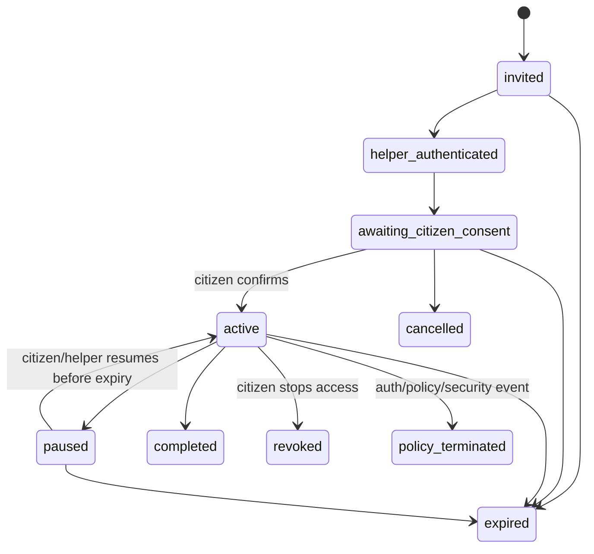

# Sahaayak Low-Bandwidth PWA and Assisted Saathi Mode — Product and Technical Specification

**Status:** implementation-ready proposal
**Priority:** P1/P2 — reach, resilience, and assisted service delivery
**Document owner:** Product and Engineering
**Last updated:** 2026-08-09
**Depends on:** current React/Vite frontend, guest authorization, text/voice turns, reviewed public catalog, source freshness, application packs, operator OIDC/MFA, department routing, consent/audit, rate limits, feature flags, telemetry, and production HTTPS
**Related documents:** [`implementation-roadmap.md`](./implementation-roadmap.md), [`application-completion-status-copilot-spec.md`](./application-completion-status-copilot-spec.md), [`household-benefits-radar-spec.md`](./household-benefits-radar-spec.md), [`india-government-ui-ux-guide.md`](./india-government-ui-ux-guide.md), [`production-operations.md`](./production-operations.md), [`voice-stream-operations.md`](./voice-stream-operations.md)

---

## 1. Executive summary

Sahaayak's intended users may rely on low-end phones, intermittent mobile data, shared devices, or local assistance. The current application has resilient text and voice fallbacks, but it is not installable, has no service worker/offline shell, and has no bounded assisted-access contract for CSC/NGO/frontline workers.

This initiative contains two connected but independently releasable capabilities:

1. **Low-Bandwidth Progressive Web App:** an installable, connection-aware app that loads a safe shell quickly, caches only reviewed public content, offers text-first/data-saver behaviour, preserves explicitly approved local text drafts, and requires confirmation before replaying any queued action.
2. **Assisted Saathi Mode:** a role-protected, time-bound workflow in which an authenticated helper assists a citizen on a shared or helper-operated device with explicit consent, minimum data exposure, visible action attribution, citizen confirmation, and an immutable audit trail.

The central safety rule is that offline resilience must not become offline data leakage. By default, Sahaayak does **not** cache guest/account tokens, profiles, household facts, transcripts, recordings, RAG answers, application references, documents, reminders, contact data, admin pages, or API responses containing citizen state.

### 1.1 Product outcome

```text
Fast installable shell
  → detect connection quality
  → prefer text or appropriate voice mode
  → use fresh network data when available
  → show approved public information offline when safe
  → preserve only citizen-approved text draft
  → confirm and submit after reconnection

Citizen requests help
  → helper authenticates
  → single-use consent/grant established
  → minimum task projection shared
  → helper guides, citizen confirms consequences
  → pack/handoff completed
  → access expires and audit remains
```

### 1.2 Primary success metrics

- **Low-bandwidth task success:** percentage of critical citizen journeys completed on the supported slow/intermittent network test profile.
- **Assisted completion rate:** percentage of consented assistance sessions that complete their declared task or reach a correctly routed escalation, without policy violations.

---

## 2. Existing implementation baseline

| Capability | Current state | Extension |
| --- | --- | --- |
| Web app | React/Vite, TanStack Router/Query, Zustand, Zod, Tailwind/shadcn | Add manifest, service worker, cache policy, offline/data-saver UI |
| Voice | clip upload fallback plus streaming WebSocket, PCM/VAD/transcript review | Select transport/quality by connection and recover from disconnect |
| Guest session | Server-issued opaque bearer and expiry | Keep network-only; offline shell does not imply authenticated offline access |
| Catalog/results | Reviewed benefits and dedicated detail pages | Add sanitized public cache endpoint and visible cached/freshness state |
| Saved/tasks/applications | Sensitive server state | Network-only; optional draft outbox stores no server response or hidden data |
| Admin/operator | OIDC/MFA roles, queues, audit | Add dedicated `assistant` role/capability and assistance-session scoping |
| Directory/escalation | Approved routing and operator workflow | Route assisted citizen to verified office/operator when task cannot complete |
| Feature flags | Deterministic percentage/state/language rollout | Independent PWA, offline catalog, data-saver, assisted-mode flags |
| Telemetry | Redacted Langfuse/OpenTelemetry/event store | Add network/cache/recovery/assistance metrics without citizen content |

### 2.1 Confirmed gaps

- No `.webmanifest`, install icons, install/update UX, or service worker.
- No documented HTTP/service-worker cache contract.
- No safe offline draft/outbox or reconnection confirmation.
- No connection-quality mode selection.
- No dedicated assisted-session model, purpose grant, citizen consent receipt, delegated projection, or assisted-action audit.
- Existing admin/operator roles are not sufficient by themselves for citizen-side delegated access.

---

## 3. Goals and non-goals

### 3.1 Goals

1. Make the citizen app installable and fast to reopen.
2. Render navigation, accessibility/help, language selection, and a safe offline page without network access.
3. Cache only explicitly classified public, reviewed, non-sensitive resources.
4. Detect effective connectivity and offer text-first/data-saver choices.
5. Preserve an explicitly approved local text draft with clear expiry/removal controls.
6. Never automatically replay a conversation/application mutation after reconnection.
7. Recover voice safely across network interruption without duplicate turns or charges.
8. Allow authenticated helpers to assist citizens under a narrow, expiring purpose grant.
9. Keep the citizen aware of helper identity, access, actions, and session end.
10. Support QR/short-code handoff without placing PII or durable credentials in the code.
11. Produce a safe print/share application pack and verified department handoff.
12. Meet GIGW/WCAG-oriented accessibility and the existing Indian public-service visual guidance.

### 3.2 Non-goals for the first release

- Full offline eligibility matching against the entire private/user profile.
- Offline RAG or storing the OpenAI vector corpus in the browser.
- Offline voice recognition or TTS model downloads.
- Background submission of applications, voice turns, payments, OTPs, or consent.
- Caching authenticated pages for offline use.
- Treating `navigator.onLine` as proof of internet/API availability.
- Silent service-worker updates during a consequential workflow.
- Helpers sharing one generic account or static admin token.
- Helpers impersonating citizens, accepting legal declarations, entering OTPs, or accessing DigiLocker without the citizen.
- Permanent helper access to a citizen account/household.
- Recording assistance sessions by default.
- Claiming affiliation with CSC/MeitY/government without an actual agreement.

---

## 4. Operating modes

### 4.1 Online standard

- Full reviewed text/RAG/matcher flow.
- Streaming voice when enabled and connection/provider policy supports it.
- Normal images/icons/fonts and admin routes.
- Server remains source of truth.

### 4.2 Online data-saver

- Text is primary.
- No decorative media or automatic audio download/playback.
- Voice defaults to push-to-talk clip upload with compressed/short bounded turns if quality is adequate.
- TTS is opt-in per response or disabled; text always available.
- Reduce prefetching and do not preload admin/voice bundles.
- Citizen can enable manually; the app may suggest it based on connection evidence.

### 4.3 Intermittent connection

- Existing content remains visible with a clear “connection lost” status.
- Unsubmitted text stays in memory; citizen may explicitly save a local draft.
- In-flight operation displays whether the server acknowledged it.
- Retry uses the same idempotency key only after citizen confirmation when the result is uncertain.
- Voice recording stops safely and offers review/upload-later text fallback.

### 4.4 Offline safe shell

- App shell, help, privacy/accessibility information, language UI, and explicitly cached public catalog/details are available.
- No claim that live eligibility, status, source freshness, or availability was checked.
- No saved applications, household, contacts, reminders, transcripts, or admin state is shown from cache.
- Citizen may compose a local text draft and review public instructions.
- Submission waits for network and explicit confirmation.

### 4.5 Assisted Saathi Mode

- Helper uses a workforce-authenticated, purpose-limited surface.
- Citizen may remain a guest or authenticate to their own account separately.
- Helper sees only the current task projection.
- Every consequential action is citizen-confirmed.
- Access ends on completion, timeout, citizen revoke, helper logout, or policy event.

---

## 5. PWA technical architecture

### 5.1 Chosen frontend approach

Use `vite-plugin-pwa` with Workbox in `injectManifest` mode or an equivalently auditable custom service worker. `injectManifest` is preferred because Sahaayak needs an explicit route-by-route cache allowlist rather than broad generated runtime caching.

Add:

```text
apps/web/public/manifest.webmanifest
apps/web/public/icons/*
apps/web/src/pwa/service-worker.ts
apps/web/src/pwa/register-service-worker.ts
apps/web/src/pwa/cache-policy.ts
apps/web/src/pwa/offline-store.ts
apps/web/src/pwa/network-status.ts
apps/web/src/features/pwa/*
apps/web/src/routes/offline.tsx
```

Use a small, maintained IndexedDB wrapper such as `idb` for explicitly approved drafts and public cache metadata. Do not introduce a second client state framework.

### 5.2 Web app manifest

Required fields:

- stable `id` and `start_url` without user/session identifiers;
- `scope: "/"`;
- localized or neutral `name`/`short_name` consistent with independent Sahaayak branding;
- `display: "standalone"` with browser fallback;
- DBIM/GIGW-aligned `theme_color` and `background_color`;
- maskable and standard icons at required sizes;
- `lang`/`dir` strategy and localized manifests where supported;
- only safe shortcuts such as “Ask Sahaayak” and “Browse benefits”; no direct household/admin shortcut.

The `start_url` must not contain tracking parameters. Install metadata and screenshots must not imply government ownership or certification.

### 5.3 Service-worker lifecycle

1. Register after the initial interactive page, not before critical text renders.
2. Install precaches only versioned static shell assets.
3. Activate deletes only known old cache names and never calls broad origin-wide deletion.
4. New worker waits while a consequential form/recording is active.
5. UI announces **Update available** and lets the citizen apply it when safe.
6. `skipWaiting` occurs only after explicit update action or on a fresh no-work client.
7. `clientsClaim` is used only with tested update semantics.
8. A rollback deployment changes cache version and purges incompatible public data.

### 5.4 Cache names

```text
sahaayak-shell-<build-id>
sahaayak-public-catalog-<schema-version>
sahaayak-public-content-<schema-version>-<locale>
sahaayak-fonts-<font-version>
```

Never use user/session/account IDs, language preference beyond safe locale, state derived from precise location, benefit application reference, or provider token in cache names.

---

## 6. Cache classification and request strategy

The service worker uses a deny-by-default strategy. A request is cached only if both its route class and response headers explicitly permit it.

### 6.1 Cache matrix

| Resource | Strategy | Offline | Required response policy |
| --- | --- | --- | --- |
| Hashed JS/CSS/static icons | Cache first/precache | Yes | Immutable hashed assets |
| Self-hosted Noto font subsets | Cache first | Yes | Versioned, CORS-safe, immutable |
| `/offline` and static help shell | Precache | Yes | Contains no user data |
| Local reviewed UI locale bundle | Precache/cache first | Yes | Build-versioned |
| Sanitized public catalog endpoint | Network first with bounded timeout; safe cache fallback | Yes, visibly cached | `public`, ETag, schema/freshness metadata |
| Sanitized public benefit detail | Stale-while-revalidate or network first | Yes, visibly cached | Active reviewed public projection only |
| Official source document/PDF | Browser/network; no Sahaayak cache by default | No | External source rules apply |
| Guest/account/auth/session API | Network only | No | `private, no-store` |
| Turns/RAG/voice/WebSocket | Network only | No | `no-store` |
| Saved benefits/tasks/reminders | Network only | No | `private, no-store` |
| Applications/household/facts | Network only | No | `private, no-store` |
| Contacts/consent/notifications | Network only | No | `private, no-store` |
| Pack/PDF artifact | Network only | No | `private, no-store`, short-lived |
| Admin/OIDC/telemetry | Network only | No | `private, no-store` |
| Provider callbacks/webhooks | Service worker never handles | No | Server-to-server |
| Audio input/output | Memory/stream only; no Cache API | No | `no-store` |

### 6.2 Sanitized public endpoints

Do not cache the existing endpoint automatically until its response contract is reviewed. Add explicit endpoints such as:

```text
GET /api/public/catalog?state=KA&language=kn&cursor=...
GET /api/public/benefits/{benefit_id}?language=kn
GET /api/public/content-manifest?state=KA&language=kn
```

Public projection may include:

- benefit/job public ID, title, domain, state, summary;
- public eligibility criteria text—not a user verdict;
- documents and generic application steps;
- official department/source/application URL;
- last verified date, freshness/active state, public revision;
- locale and content schema version.

It excludes:

- any session-specific match/rank/explanation;
- profile facts or criterion evaluation;
- saved state, tasks, reminders, reports;
- internal review notes/model lineage;
- unpublished/unapproved/inactive rows;
- signed URLs or private object keys.

### 6.3 HTTP headers

- Sensitive routes: `Cache-Control: private, no-store, max-age=0`, `Pragma: no-cache` where compatibility requires.
- Public reviewed projection: explicit `public, max-age=<short>, stale-while-revalidate=<bounded>` plus `ETag` and `Last-Modified` where reliable.
- HTML navigation shell: revalidate on network; safe offline fallback.
- Service-worker script: `Cache-Control: no-cache` to permit update checks.
- Manifest/icons/fonts: correct MIME, CSP, and long immutable cache only when versioned.

The service worker also checks a response marker such as `X-Sahaayak-Cache-Class: public-reviewed-v1`; absence means no runtime caching.

### 6.4 Cache bounds and eviction

- Public catalog max entries/age configured by state/locale.
- Evict least-recently-used public entries when size limit is reached.
- Purge a benefit when network response marks it inactive/withdrawn.
- Purge locale/state caches when rollout is disabled or schema is incompatible.
- Provide **Clear downloaded public information** in settings.
- Detect storage pressure and continue without caching.

---

## 7. Offline draft and outbox logic

### 7.1 Allowed local draft

Only a citizen-authored text draft for a future conversation/search may be stored, and only after an explicit action such as **Save this draft on this device**.

Do not store:

- voice/audio;
- transcript returned by STT;
- server/LLM answer;
- profile/household facts;
- application field/reference/status;
- contact or reminder destination;
- document metadata/content;
- consent/legal declaration;
- admin/operator form;
- token or API response.

### 7.2 Draft record

```ts
type OfflineDraft = {
  id: string;
  text: string;
  locale: string;
  createdAt: string;
  expiresAt: string;
  userApproved: true;
  submissionIdempotencyKey: string;
  schemaVersion: 1;
};
```

Do not store member IDs or sensitive context. Household/application screens can offer copy-to-clipboard but not offline persistence in v1.

### 7.3 Expiry and deletion

- Default expiry: 24 hours; configurable but always visible.
- Delete immediately after confirmed server acceptance or citizen discard.
- Expiry cleanup runs on startup, draft read, and service-worker activation.
- Settings show count and **Clear offline drafts**.
- Browser storage encryption with a key stored in the same origin does not protect against a compromised/shared browser; therefore minimization and short retention are primary controls.

### 7.4 Reconnection flow

1. Network monitor detects successful API health probe—not merely browser online state.
2. UI shows the draft and current locale.
3. Citizen reviews/edits it.
4. UI warns if the app/content version materially changed.
5. Citizen selects **Send now**.
6. Mutation sends the stored idempotency key.
7. Server returns accepted/replayed outcome.
8. Client deletes draft only after unambiguous acknowledgement.
9. On timeout/unknown outcome, client queries operation status if supported or asks before retrying with the same key.

No Background Sync API automatically submits the turn.

---

## 8. Network detection and adaptive behaviour

### 8.1 Connection state

Use a composite state machine:

```text
unknown
online_good
online_constrained
degraded
offline
recovering
```

Inputs:

- browser online/offline events as hints;
- same-origin lightweight health probe with timeout;
- recent API request success/failure;
- optional Network Information API (`effectiveType`, `saveData`, RTT) when available;
- WebSocket status for streaming voice;
- user-selected Data Saver preference.

Do not fingerprint or persist detailed network characteristics.

### 8.2 Mode selection

- User preference always overrides an automatic suggestion.
- `saveData=true` or repeated high latency suggests data-saver mode.
- Streaming voice requires explicit feature flag, supported browser/audio worklet, successful WebSocket, provider availability, budget, and acceptable recent connection.
- Degraded streaming falls back to clip or text after preserving/confirming the transcript boundary.
- No infinite retry loop.

### 8.3 UI states

- Persistent but non-obstructive status near the primary task.
- “Offline—showing downloaded public information” is explicit.
- Cached cards show download/freshness timestamp.
- Live-only actions are disabled with an explanation and alternate draft/help route.
- Reconnection status uses a polite live region; do not announce every network fluctuation.

---

## 9. Voice resilience

### 9.1 Streaming path

- Keep bounded PCM frames and current transcript-review gate.
- Associate each turn with a server-issued idempotency/stream attempt ID.
- Server acknowledges start, transcript finalization, reasoning acceptance, and TTS chunks separately.
- Client tracks the last unambiguous stage in memory only.
- On disconnect before transcript acceptance, do not run matcher/RAG.
- On disconnect after accepted transcript, query turn outcome before replay.

### 9.2 Clip fallback

- Record bounded audio duration and size.
- Display estimated data size before upload in data-saver mode.
- Stop/discard controls remain available.
- Audio remains in memory or an ephemeral browser Blob and is deleted after success/discard/page close.
- Do not use IndexedDB/Cache API for audio.

### 9.3 TTS

- Text appears before optional audio.
- Sentence-level chunks may stream when online.
- Data-saver mode requires tap to play and does not prefetch.
- On TTS failure, text remains complete and retry is explicit.
- Barge-in stops local playback and sends bounded interruption when connected.

### 9.4 Duplicate/cost controls

- Reserve provider budget by operation/attempt.
- Reused idempotency keys do not create a second reasoning/provider charge where avoidable.
- Telemetry records stages and cost class without transcript/audio.
- Recovery tests include disconnect before/after each acknowledgement boundary.

---

## 10. Install, update, and uninstall experience

### 10.1 Install

- Never block the first task with an install prompt.
- Offer install after a successful repeat visit or explicit menu action.
- Explain benefits honestly: faster opening and safe public information offline; not full offline eligibility/voice/applications.
- Provide manual platform instructions when browser install prompt is unavailable.
- Respect dismissal and do not nag repeatedly.

### 10.2 Update

- Show release version and update availability.
- Defer update while recording, editing a draft, confirming application status, or completing assisted consent.
- Apply after explicit action and restore non-sensitive route state.
- If schema migration fails, clear only Sahaayak-owned offline stores and explain; never clear unrelated browser data.

### 10.3 Uninstall/clear data

- Explain that uninstalling may not delete server data.
- Provide separate **Clear this device's offline data**, **Sign out/revoke session**, and **Delete Sahaayak account/session** actions.
- On logout/session deletion, notify the service worker to clear Sahaayak local drafts and user-associated in-memory state. Public caches may remain unless the citizen chooses all-data clearing.

---

## 11. Assisted Saathi Mode product model

### 11.1 Definition

Saathi Mode is a temporary assistance relationship between:

- a citizen/guest session or citizen account;
- an authenticated helper;
- one declared task/purpose;
- a bounded data projection;
- explicit consent and expiration.

It is not account delegation, impersonation, or permanent household membership.

### 11.2 Helper identities

Add `assistant` as a bounded workforce role/capability, distinct from `operator`:

- `assistant`: citizen-facing guided task access only after a grant;
- `operator`: escalation queue and resolution;
- `reviewer`: public data governance;
- `admin`: policy/configuration;
- `observer`: aggregate read-only.

A person may have multiple capabilities through IdP role mapping, but APIs check the specific action capability. Production helper login requires managed OIDC, MFA, named user, organization/centre metadata, and session/device controls. Shared credentials are prohibited.

### 11.3 Assistance purposes

Initial allowlist:

```text
discover_benefits
prepare_application
record_application_reference
contact_department
create_escalation
print_application_pack
language_or_accessibility_help
```

Excluded from v1:

```text
enter_otp
accept_legal_declaration
make_payment
connect_digilocker
change_account_recovery
export_household
delete_account
```

### 11.4 Session initiation options

#### Citizen-created QR/short code

1. Citizen selects **Get help from a person**.
2. Citizen chooses task and sees data categories to share.
3. Server creates a single-use, random, short-lived grant invitation.
4. QR/short code contains only invitation token or URL; no PII/session ID.
5. Helper signs in, redeems invitation, and sees consent confirmation.
6. Citizen confirms on their device or through an in-person witnessed confirmation flow.

#### Helper-started session on shared device

1. Helper authenticates.
2. Selects **Start new citizen assistance** and purpose.
3. App creates a fresh isolated guest session.
4. Citizen reads/hears the notice and explicitly consents.
5. Helper enters only citizen-provided information.
6. At end, citizen receives/chooses a handoff method; helper access expires and shared device is cleared.

#### Existing escalation handoff

An operator may invite the citizen into a purpose-limited assistance session linked to an assigned ticket. Ticket access does not automatically grant household/application field access.

### 11.5 Citizen consent

Consent screen states:

- helper display name and organization/centre;
- exact purpose;
- categories visible/editable;
- whether a print/share action will occur;
- session expiry;
- how to stop assistance;
- that the helper cannot see OTP/password/DigiLocker or act after expiry;
- language and accessible alternative.

Consent uses an affirmative action by the citizen. Helper cannot click the citizen confirmation while in helper-authenticated mode without a documented witnessed-consent fallback, which must record mode and reason.

---

## 12. Assisted-session lifecycle

### 12.1 States

```text
invited
helper_authenticated
awaiting_citizen_consent
active
paused
completed
revoked
expired
cancelled
policy_terminated
```

### 12.2 State machine



Only `active` grants task APIs. Terminal states immediately revoke tokens and local helper projection.

### 12.3 Consequential actions

Require citizen confirmation for:

- storing a profile fact/life event;
- starting/updating/submitting an application case;
- recording a reference/status;
- adding/verifying contact;
- enabling external reminders;
- sharing/printing a pack with sensitive fields;
- creating a human escalation with citizen data;
- navigating to an official portal with prefilled handoff.

Helper may browse reviewed public information, explain criteria, fill a draft, and mark checklist preparation without final consequence, subject to scope.

### 12.4 End-of-session receipt

Citizen receives an in-app/print/QR summary containing:

- helper/organization display identity;
- start/end time and purpose;
- public benefit/application IDs touched;
- actions completed and actions awaiting citizen confirmation;
- contact/escalation destination;
- how to report concern;
- no sensitive field values by default.

---

## 13. Assisted data projection

### 13.1 Projection rules

The server builds an `AssistanceProjection` from purpose and grant. The client cannot request arbitrary fields.

Examples:

| Purpose | Visible | Hidden |
| --- | --- | --- |
| Discover benefits | selected language/state, confirmed relevant matcher slots, result evidence | contacts, references, other members, prior transcripts |
| Prepare application | selected case requirements and citizen-approved draft fields | unrelated benefits/household facts, provider tokens |
| Record reference | selected case, masked current reference, status form | documents, contact plaintext, other cases |
| Contact department | query domain/location and approved directory projection | income/category/disability unless routing explicitly requires and citizen approves |
| Print pack | citizen-reviewed pack preview | hidden profile fields and all excluded values |

### 13.2 Masking and privacy mode

- Sensitive values masked until citizen uses a reveal control.
- Reveal is time-bounded and audited; helpers cannot reveal restricted values unless purpose policy permits.
- Shared-device privacy mode hides browser autofill, recent-history suggestions, and OS notification previews where controllable.
- Idle timeout blanks the screen and requires helper reauthentication plus citizen presence confirmation.
- Clipboard copy of sensitive values is disabled where practical; print/share requires review.

### 13.3 No helper retention

- Helper portal sends `Cache-Control: no-store`.
- No service-worker caching of assisted/admin routes.
- On session end, clear React Query cache, Zustand transient state, form values, audio blobs, print previews, and assistance tokens.
- Browser download of citizen artifacts is disabled by default on helper devices; direct citizen transfer/print uses audited controls.
- Server helper projection expires independently of browser cleanup.

---

## 14. Assisted data model

### 14.1 `AssistanceSession`

| Field | Type | Notes |
| --- | --- | --- |
| `id` | string PK | Opaque |
| `invitation_token_hash` | string unique | Single-use; raw token never stored |
| `citizen_session_id` | FK nullable | Guest subject |
| `citizen_account_id` | FK nullable | Account subject; at least one subject required |
| `household_member_id` | FK nullable | Optional bounded subject |
| `helper_actor_id` | string nullable | Set after OIDC redemption |
| `helper_org_id` | string | Bounded IdP claim/registered centre |
| `purpose` | enum | Allowlisted |
| `status` | enum | Lifecycle state |
| `projection_version` | string | Policy used |
| `expires_at`, `last_activity_at` | datetime | Short and bounded |
| `created_at`, `consented_at`, `ended_at` | datetime | UTC |
| `revision` | integer | Optimistic concurrency |

### 14.2 `AssistanceConsent`

Append-only:

- assistance session;
- action: granted/withdrawn/expired;
- notice version, locale, confirmation mode;
- approved data categories/actions;
- citizen principal hash or witnessed mode;
- helper actor and timestamp;
- no signature image/audio recording by default.

### 14.3 `AssistanceAction`

Append-only action ledger:

- assistance session;
- action key and target type/opaque ID;
- stage: drafted, citizen_confirmed, executed, failed, reversed;
- helper actor and confirmation actor/mode;
- before/after safe hashes or masked snapshots;
- request/idempotency key;
- timestamp, reason/error class.

Do not store profile values, references, contact plaintext, transcript, or generated pack content in the action ledger.

### 14.4 `AssistanceOrganization`

Admin-managed registry:

- organization/centre ID and display name;
- type: CSC/NGO/department/help centre/other;
- official source/verification where applicable;
- allowed states/districts/purposes;
- active/suspended status;
- identity-provider group/role mapping;
- policy version, last verified date, revision history;
- contact fields visible only as public organizational contacts.

Do not label an organization as CSC/government unless verified from an official source or contractual onboarding.

### 14.5 `AssistanceIncident`

Citizen/operator report linked to an assistance session with category, severity, status, owner, redacted description, audit history, SLA, and resolution. Reuse escalation patterns while keeping misconduct/security incidents separate from service-routing tickets.

---

## 15. Assisted APIs

### 15.1 Citizen invitations

| Method and path | Purpose |
| --- | --- |
| `POST /api/assistance/invitations` | Citizen creates purpose/data-category invitation |
| `GET /api/assistance/invitations/{id}` | Citizen checks safe state |
| `POST /api/assistance/invitations/{id}/consent` | Citizen confirms after helper identity is known |
| `POST /api/assistance/sessions/{id}/revoke` | Citizen immediately revokes |
| `GET /api/assistance/sessions/{id}/receipt` | Citizen retrieves safe receipt |

### 15.2 Helper APIs

Require managed workforce OIDC/MFA and `assistant` capability:

| Method and path | Purpose |
| --- | --- |
| `POST /api/assistant/invitations/redeem` | Redeem single-use code after authentication |
| `POST /api/assistant/sessions` | Start fresh shared-device guest assistance |
| `GET /api/assistant/sessions/{id}` | Purpose-bound projection |
| `POST .../{id}/draft-actions` | Create non-consequential draft |
| `POST .../{id}/actions/{action_id}/execute` | Execute only after valid citizen confirmation |
| `POST .../{id}/complete` | Complete and generate receipt |
| `POST .../{id}/pause` | Pause and clear projection |
| `POST .../{id}/incidents` | Report safety/security concern |

### 15.3 Token design

- Invitation token: at least 128 bits entropy, single-use, short TTL, hashed at rest.
- Assistance access token: audience/purpose/session-bound, short-lived, never accepted by citizen/admin APIs broadly.
- QR URL contains no citizen/session/account/member identifier.
- Short code is rate-limited by helper, IP/risk signal, and invitation; responses do not reveal existence before helper auth.
- Revocation publishes a cache/event signal and APIs always verify database/Redis revocation state.

### 15.4 Errors

- `ASSISTANCE_INVITATION_EXPIRED`;
- `ASSISTANCE_INVITATION_USED`;
- `ASSISTANCE_CONSENT_REQUIRED`;
- `ASSISTANCE_PURPOSE_NOT_ALLOWED`;
- `ASSISTANCE_ACTION_NOT_ALLOWED`;
- `ASSISTANCE_CITIZEN_CONFIRMATION_REQUIRED`;
- `ASSISTANCE_SESSION_REVOKED`;
- `ASSISTANCE_HELPER_NOT_AUTHORIZED`;
- `ASSISTANCE_ORGANIZATION_SUSPENDED`;
- `ASSISTANCE_STEP_UP_REQUIRED`.

---

## 16. Frontend information architecture

### 16.1 Citizen PWA routes

```text
/offline
/settings/data-usage
/settings/offline-data
/help/install
/help/connection
/assistance/request
/assistance/$sessionId
/assistance/$sessionId/receipt
```

### 16.2 Helper routes

Use a separately lazy-loaded and non-cacheable shell:

```text
/assistant
/assistant/redeem
/assistant/sessions/new
/assistant/sessions/$sessionId
/assistant/sessions/$sessionId/receipt
/assistant/incidents
```

The helper shell may share UI primitives but not citizen Query/Zustand caches. Prefer a separate QueryClient and an explicit purge on end/logout.

### 16.3 Components

- `NetworkStatusBanner`;
- `DataSaverControl`;
- `InstallAppCard`;
- `UpdateAvailableDialog`;
- `OfflinePublicContentNotice`;
- `OfflineDraftEditor`;
- `ReconnectReviewDialog`;
- `VoiceTransportStatus`;
- `AssistanceInvitationCard` with QR/short code;
- `HelperIdentityPanel`;
- `AssistanceScopeSummary`;
- `CitizenConfirmationPanel`;
- `AssistanceSessionTimer`;
- `AssistanceReceipt`;
- `ClearDeviceDataDialog`.

### 16.4 UX safeguards

- Offline/cached status appears adjacent to content/action, not only in a global banner.
- Install/update/connection prompts never cover microphone/transcript confirmation.
- QR has a text code and URL alternative; scanning is never the only route.
- Session timer does not create panic; warn and allow safe extension with citizen confirmation.
- Helper and citizen actions are visually distinct and text-labelled.
- Consequential confirm controls remain on a citizen-facing panel/mode.
- Print preview visibly lists included fields before printing.

---

## 17. Accessibility and localization

### 17.1 PWA/offline

- Manifest/application name and install instructions are localized and reviewed.
- Offline banner uses `role=status` politely and does not repeatedly announce flapping.
- Cached timestamps are understandable in locale and have machine-readable times.
- Disabled live actions explain the alternative.
- Install/update dialogs are keyboard-operable, focus-trapped correctly, and respect reduced motion.
- Offline content retains landmarks, heading order, 320px reflow, 200% zoom, and text spacing.
- Service-worker update does not unexpectedly reset focus.

### 17.2 Assisted mode

- Consent can be read by screen reader, displayed in large text, and spoken in the active reviewed language.
- Helper cannot skip the notice because audio is unavailable; text always exists.
- QR includes sufficient contrast/quiet zone and a non-camera alternative.
- Timeouts warn with accessible extension controls.
- Shared-device UI offers high contrast, text resize, keyboard, touch, and screen-reader support.
- Citizen confirmation avoids complex signatures or fine motor gestures.
- Print/application packs follow accessible document requirements.
- Native speakers review helper/citizen role terminology; avoid language implying surrender of control.

### 17.3 Motion

- Install success, offline transitions, and session countdown use restrained functional motion only.
- No pulsing urgency for connectivity or deadlines.
- `prefers-reduced-motion` removes nonessential transitions.
- Connection state is never conveyed by animation alone.

---

## 18. Security, privacy, and threat model

### 18.1 HTTPS and origin

- Service workers and PWA production install require HTTPS.
- Set strict CSP, frame ancestors, referrer policy, permissions policy, MIME sniffing protection, and secure cookies according to deployment architecture.
- Prevent third-party embedding/clickjacking of citizen/helper confirmations.
- Official external links use `noopener noreferrer`, hostname disclosure, and reviewed allowlist.

### 18.2 PWA threats

| Threat | Control |
| --- | --- |
| Sensitive API response cached | Deny-by-default route matrix plus `no-store` headers and automated cache inspection |
| Shared-device draft disclosure | Opt-in text only, short TTL, clear-device control, no sensitive context |
| Malicious/stale service worker | Versioned worker, CSP/SRI where applicable, update/rollback tests, controlled activation |
| Cache poisoning | Same-origin only, response cache marker, status/content-type/schema validation |
| Stale benefit treated as live | Visible cached timestamp; no live eligibility claim; network freshness revalidation |
| Duplicate mutation after reconnect | Idempotency key, acknowledgement state, explicit replay confirmation |
| Token leakage into cache/URL | Network-only auth, no token query params, cache-key tests |
| Offline phishing/spoofed source | Independent branding, official hostname/source, cached revision/freshness labels |

### 18.3 Assisted-mode threats

| Threat | Control |
| --- | --- |
| Helper guesses/reuses short code | Auth before redeem, high-entropy invitation, rate limit, single-use, short TTL |
| Helper exceeds purpose | Server-generated projection and action allowlist |
| Helper acts without citizen | Separate consent and consequential confirmation events |
| Shared helper credentials | Named OIDC/MFA users, device/session controls, audit, organization suspension |
| Citizen leaves shared device signed in | Isolated guest by default, idle lock, end-session purge, handoff rather than persistent login |
| Helper records/copies restricted data | Masking, reveal policy/audit, no cache/download, training and incident route |
| QR leaks PII | Opaque invitation only |
| Impersonation after session | Purpose-bound token, expiry/revocation check, no durable helper membership |
| False CSC/government claim | Verified organization registry and independent Sahaayak branding |

### 18.4 Privacy and retention

- Public caches contain only reviewed public projections.
- Offline drafts are local, opt-in, text-only, short-lived, and visible/deletable.
- Assistance invitation/session default TTL is short and configurable; completed session retains only consent/action/audit metadata per policy.
- Assistance projection is generated, not durably copied.
- Incident records follow separate restricted retention.
- Telemetry excludes QR/code/token, helper/citizen IDs, profile values, transcript, reference, contact, document and free text.

### 18.5 Security headers/cache verification

CI and deployment smoke must fetch representative routes and assert:

- sensitive endpoints are `no-store`;
- service worker does not intercept/cache them;
- admin/helper HTML is non-cacheable;
- public cache marker appears only on reviewed projections;
- sign-out/end assistance clears client state;
- browser back/forward cache does not reveal helper/citizen sensitive pages after logout where controllable; use page lifecycle handling and server auth as primary protection.

---

## 19. Admin and operational controls

### 19.1 PWA operations dashboard

- manifest/service-worker build/schema version;
- install prompt shown/accepted/dismissed aggregate;
- active cache schema and purge status;
- online/data-saver/offline session aggregate;
- public cache hits/misses/fallbacks by state/locale;
- stale/withdrawn cache purge failures;
- offline drafts created/submitted/expired aggregate;
- reconnection duplicate-prevention outcomes;
- voice transport selection/fallback and disconnect stage;
- web vital metrics by network class without fingerprinting.

### 19.2 Assistance dashboard

- invitations/session states and expiry;
- sessions by allowed organization/purpose/state/language;
- task completion/escalation rate;
- median duration and idle termination;
- consent/revocation counts;
- attempted disallowed actions;
- incidents and SLA;
- helper auth/MFA/organization readiness;
- privacy-safe receipt/action counts;
- no raw citizen profile or session browser.

### 19.3 Organization and helper governance

- verify/edit/deactivate organizations with source and revision history;
- map IdP groups to organization/capabilities;
- suspend organization/helper access immediately;
- set allowed states/districts/purposes and operating hours;
- require training/policy attestation version;
- audit exports without citizen values;
- rollback policy/configuration.

### 19.4 Feature flags

Add:

- `pwa_install`;
- `offline_public_catalog`;
- `offline_text_drafts`;
- `adaptive_data_saver`;
- `voice_adaptive_transport`;
- `assisted_saathi_mode`;
- `assisted_shared_device`;
- `assisted_household_access`;
- `assisted_pack_printing`.

Roll out by deterministic subject, language, state, organization, and helper capability. Turning off assisted mode immediately prevents new sessions; active sessions receive a bounded termination notice and are revoked.

---

## 20. Observability and performance

### 20.1 PWA telemetry

Events:

- `pwa_install_prompted/accepted/dismissed`;
- `service_worker_installed/activated/update_available/update_applied/error`;
- `network_mode_changed`;
- `public_cache_hit/miss/stale_fallback/purged`;
- `offline_draft_saved/submitted/expired/deleted`;
- `reconnect_action_confirmed/accepted/unknown/replayed`;
- `voice_transport_selected/fallback/disconnected/recovered`.

### 20.2 Assisted telemetry

- `assistance_invited/redeemed/consented/active/paused/completed/revoked/expired`;
- `assistance_action_drafted/confirmed/executed/denied/failed`;
- `assistance_projection_denied`;
- `assistance_incident_created/resolved`;
- `assistance_client_purge_completed/failed`.

Safe dimensions: deployment/build, browser family, state/language, network class, cache class, action key, purpose, organization type/opaque aggregate key, outcome/error class, duration. Enforce bounded cardinality.

### 20.3 Performance budgets

Citizen shell targets on the agreed low-end/slow profile:

- initial critical shell JS/CSS compressed budget defined and enforced in CI;
- LCP <= 2.5 s p75 where measured production conditions permit;
- INP <= 200 ms p75;
- CLS <= 0.1;
- text composer usable before voice/admin bundles load;
- offline repeat launch reaches safe shell in under 1 second on test device target;
- no admin/helper bundle in citizen initial chunk;
- locale/font subsets loaded only as needed.

Exact bundle-byte thresholds are set from the current measured baseline before implementation, then fail CI on unjustified regression.

### 20.4 SLOs

- 100% sensitive route fixtures absent from Cache Storage after E2E run.
- No automatic consequential mutation replay.
- Reconnect duplicate rate effectively zero under deterministic fault tests.
- Assistance revoke takes effect on next API request and within seconds for an active UI via push/poll.
- 100% assisted mutations have helper identity, purpose, consent state, and confirmation provenance.
- End-session purge passes on supported browsers.

---

## 21. Infrastructure and deployment

### 21.1 Web hosting

- HTTPS and stable origin are mandatory.
- Correct MIME for manifest/service worker.
- Service-worker scope intentionally `/` only for the citizen origin; if admin/helper use the same origin, routing policy must explicitly bypass/cache-deny them.
- Consider separate admin/helper origin in production for stronger isolation; if adopted, CORS/auth/CSP and deployment records are separate.
- CDN caches only hashed static/public reviewed resources; never authenticated responses.

### 21.2 API additions

- sanitized public catalog/content manifest endpoints;
- operation acknowledgement lookup for uncertain reconnect outcomes;
- assistance invitation/session/action/receipt/incident routes;
- organization governance routes;
- cache purge/version manifest endpoint for operations.

### 21.3 Worker/process additions

- No worker is required for basic PWA.
- Optional public-cache manifest builder runs after benefit publication and emits state/locale/revision sets.
- Assistance expiry/revocation sweeper finalizes stale sessions and emits audit events.
- Notification/pack workers remain separate and consume confirmed actions only.

### 21.4 Data and backup

- Browser caches/drafts are not backed up.
- Assistance session/consent/action/incident tables are backed up and restore-tested.
- Public cache can be rebuilt from approved Postgres benefit revisions.
- Deployment revisions record service-worker/cache schema version for comparison and rollback.

### 21.5 Configuration

Add safe settings for:

- cache schema/version and public max age;
- offline draft TTL/max length;
- health-probe interval/timeout;
- data-saver thresholds;
- assistance invitation/session/idle TTL;
- organization/purpose policy;
- public/helper origins;
- minimum app version and emergency service-worker purge generation.

Secrets remain in deployment environment and never in manifest/service-worker bundles.

---

## 22. Rate limits and abuse controls

Suggested starting limits:

- public catalog: IP/cohort-friendly high read limit with CDN shielding;
- health probe: client backoff and server lightweight limit;
- offline draft submission: existing turn limit plus idempotency;
- invitation create: 10/hour/citizen/session;
- invitation redeem: 20/hour/helper and strict short-code failure lockout;
- shared-device session create: 20/day/helper plus organization policy;
- consent attempts: bounded, no helper retries after citizen decline;
- assisted actions: action-specific existing citizen limits plus helper/session limits;
- print pack: 3/hour/session/case;
- incident report: abuse-protected but always accessible through alternate support.

Risk controls may use IP/device signals only in privacy-minimizing, bounded form and must not create a hidden persistent fingerprint.

---

## 23. Testing strategy

### 23.1 Service-worker/unit tests

- request classifier deny-by-default;
- cache-key normalization;
- public response marker/schema validation;
- sensitive route exclusion;
- cache version/purge logic;
- offline draft TTL/length/schema;
- network state reducer;
- update deferral during consequential state;
- connection-aware voice selection.

### 23.2 PWA browser tests

- installability/manifest/icon/scope in supported Chromium;
- graceful browser experience where install is unsupported;
- first online load, repeat load, offline launch;
- public catalog/detail cached fallback with visible timestamp;
- no authenticated data after offline launch;
- draft save/restart/reconnect/review/submit/delete;
- timeout at each mutation acknowledgement boundary;
- service-worker update during idle and active workflow;
- logout/session delete/device-clear behaviour;
- storage quota failure and cache corruption recovery;
- network transitions using deterministic Playwright/CDP profiles where possible;
- Safari/iOS and Firefox behaviour documented through manual/automated supported tests.

### 23.3 Voice fault matrix

Disconnect:

1. before WebSocket start acknowledgement;
2. during audio frames;
3. after final audio but before transcript;
4. during transcript deltas;
5. after transcript acceptance but before reasoning result;
6. during sentence TTS;
7. during barge-in;
8. during fallback clip upload.

For each, assert no duplicate matcher/RAG turn, no unintended charge reservation, clear citizen state, text fallback, and recoverable retry.

### 23.4 Assisted-mode tests

- invitation entropy, expiry, single use, and non-enumeration;
- helper OIDC/MFA/capability/organization status;
- citizen consent required and revocation immediate;
- purpose projection for every allowlisted task;
- denied cross-purpose action;
- consequential confirmation provenance;
- concurrent helper/citizen state conflict;
- pause/idle/expire/policy termination;
- end-session purge and browser back behaviour;
- receipt completeness and no sensitive values;
- incident route and organization suspension;
- cross-citizen/session/household IDOR attempts;
- no helper PWA/cache storage.

### 23.5 Accessibility/localization tests

- keyboard and screen-reader install/update/offline/consent/QR/timer/receipt;
- 320px, 200% zoom, text spacing, orientation, forced colors, reduced motion;
- localized manifest/install copy where supported;
- English/Hindi/Kannada long text and script rendering;
- QR code text alternative;
- helper/citizen role announcements;
- offline and network-change live-region noise.

### 23.6 Security tests

- Cache Storage inspection with synthetic profile/reference/token markers;
- service-worker cache poisoning/content-type confusion;
- malicious old worker/update rollback;
- token/query/referrer leakage;
- invitation brute force/replay;
- clickjacking/CSRF/open redirect;
- helper privilege escalation;
- sensitive print/download/clipboard attempts;
- log/trace scan for drafts, tokens, profiles, references, codes.

---

## 24. Demo scenarios

### Scenario 1 — offline reviewed information

1. Online citizen opens a reviewed Karnataka scholarship and enables downloaded public information.
2. Device goes offline.
3. App opens from home screen, clearly says offline, and shows the cached public details/source timestamp.
4. Eligibility and application-status actions are visibly unavailable because they require live verification.
5. Citizen writes and explicitly saves a text question.
6. Network returns; citizen reviews and submits once.

### Scenario 2 — constrained voice recovery

1. Data-saver mode chooses clip/text over streaming.
2. Upload disconnects at a controlled point.
3. UI explains whether the turn was acknowledged.
4. Citizen uses transcript/text fallback and submits without duplicate reasoning.

### Scenario 3 — in-person Saathi assistance

1. Named helper signs in with MFA and starts `prepare_application` assistance.
2. Citizen sees helper identity, purpose, fields, expiry, and consents.
3. Helper opens a reviewed benefit, completes a draft checklist, and prepares a pack.
4. Citizen reviews included fields and confirms printing.
5. Session completes, receipt is issued, helper UI purges citizen state.

### Scenario 4 — citizen-created QR handoff

1. Citizen creates a `contact_department` invitation.
2. Helper redeems opaque QR after authentication.
3. Helper sees only domain/location routing projection.
4. Verified directory entry is selected and citizen confirms handoff.
5. Citizen revokes; further helper requests fail.

### Scenario 5 — denied action

Helper in `discover_benefits` purpose attempts to record an application reference. Server rejects it, admin telemetry records a policy denial, and citizen data remains unchanged.

---

## 25. Delivery plan

### Phase 0 — baseline and cache contract

- Measure current bundles/web vitals/slow-network journey.
- Add route/response cache classification and `no-store` headers.
- Add automated sensitive-cache inspection before service worker.
- Finalize manifest/independent branding/icons and CSP.

### Phase 1 — installable safe shell

- Manifest, icons, service-worker registration/lifecycle.
- Precache versioned shell, locale bundles, fonts, offline/help routes.
- Install/update/clear-device UI.
- CI installability and cache tests.

### Phase 2 — reviewed public offline content and data saver

- Sanitized public catalog/detail/content manifest.
- Bounded cache/purge/freshness UX.
- Network state and data-saver controls.
- Performance/bundle budgets.

**Demo outcome:** installed app opens offline with reviewed public information and no sensitive data.

### Phase 3 — drafts and voice recovery

- Explicit local text drafts, TTL, review/reconnect/idempotency.
- Adaptive voice transport and acknowledgement recovery.
- Full disconnect fault matrix.

### Phase 4 — Saathi foundations

- Assistant role/capability, organization registry.
- Assistance invitation/session/consent/action models and APIs.
- Citizen QR/short code and helper shell.
- Purpose projection and end-session purge.

### Phase 5 — assisted tasks

- Public discovery and accessibility/language help.
- Application preparation/pack printing.
- Department handoff and escalation.
- Incident workflow, admin metrics, staged organizations.

### Phase 6 — household/account integration

- Account/member-scoped assistance grants.
- Keep household restricted by default; activate only after Household Radar and assisted privacy gates pass.
- External provider/document actions remain citizen-only unless separately approved.

---

## 26. Acceptance criteria

### PWA and low bandwidth

- [ ] App is installable on supported browsers and degrades normally elsewhere.
- [ ] Safe shell opens offline with clear status.
- [ ] Only reviewed public allowlisted content is cached.
- [ ] Sensitive route fixtures never appear in Cache Storage/IndexedDB.
- [ ] Cached benefit content shows revision/freshness/download time and makes no live eligibility claim.
- [ ] Data-saver mode reduces voice/media/prefetch behaviour and remains user-controlled.
- [ ] Offline text draft is opt-in, short-lived, visible, editable, deletable, and explicitly submitted.
- [ ] Reconnection cannot duplicate a turn/action.
- [ ] Service-worker updates do not interrupt consequential workflows.

### Voice resilience

- [ ] Every tested disconnect stage has a clear recovery path.
- [ ] Transcript acceptance remains mandatory before reasoning.
- [ ] Text is always available when STT/TTS/streaming fails.
- [ ] Duplicate turns/provider charges are prevented or reconciled with evidence.

### Assisted mode

- [ ] Every helper is a named, MFA-authenticated, active organization member.
- [ ] Every session has one purpose, explicit consent, bounded projection, expiry, and receipt.
- [ ] Helper cannot perform a consequential action without citizen confirmation.
- [ ] Revocation/expiry prevents further requests immediately.
- [ ] QR/short code contains no PII and is single-use.
- [ ] Helper client purges all citizen state at session end.
- [ ] Cross-purpose, cross-session, and cross-citizen authorization tests pass.
- [ ] Organization/policy changes are audited and reversible.

### Accessibility and operations

- [ ] Offline/install/update/assistance journeys pass keyboard, screen-reader, 320px, 200%, text spacing, reduced-motion and reviewed-language QA.
- [ ] Admin has privacy-safe PWA/assistance health, denial, incident, version, and rollout dashboards.
- [ ] Cache schema/service-worker build is tied to deployment comparison and rollback.
- [ ] Production HTTPS/CSP/cache headers and backup/restore evidence pass.

---

## 27. External dependencies and gates

| Capability | Code can be completed | External evidence before production |
| --- | --- | --- |
| PWA install/offline public content | Yes | HTTPS hosting, supported-browser/device QA, current reviewed benefit data |
| Adaptive voice | Yes | Real devices/networks and Kannada/Hindi provider tests |
| Helper authentication | Local Keycloak/demo | Production IdP, MFA, named users, organization mapping |
| CSC-branded/official helper rollout | Generic independent Saathi Mode only | Actual CSC/department agreement and verified organization records |
| Pack printing | Yes | Accessible print/PDF QA and secure printer/shared-device procedures |
| External messaging/handoff | Existing seams | Infobip/carrier credentials, consent, templates, webhooks |
| Household assisted access | Disabled seam | Household Radar production gate and assisted privacy review |

Official references to re-verify during implementation:

- [GIGW performance/PWA guidance](https://guidelines.india.gov.in/activity/techniques-and-tools-for-website-speed-optimization/)
- [GIGW 3.0](https://guidelines.india.gov.in/)
- [W3C Web Application Manifest](https://www.w3.org/TR/appmanifest/)
- [W3C Service Workers](https://www.w3.org/TR/service-workers/)
- [MeitY CSC Scheme 2.0](https://www.meity.gov.in/offerings/schemes-and-services/details/csc-scheme-2-0-a-way-forward-part-of-e-governance-division-ANwEDOtQWa)
- [Digital Personal Data Protection Rules, 2025](https://www.meity.gov.in/documents/act-and-policies/digital-personal-data-protection-rules-2025-gDOxUjMtQWa)

---

## 28. Definition of done

The feature is code-complete when cache classification, safe headers, manifest/service worker, public offline projections, install/update/clear controls, data-saver/network state, offline draft confirmation, voice recovery, assisted identity/session/consent/action models, purpose projections, receipts, organization governance, telemetry, migrations, tests, and runbooks are deployable behind independent flags.

It is demo-ready when the application completes the five demo scenarios using reviewed Karnataka public content, a controlled network fault profile, named local Keycloak helper identity, explicit citizen consent, a generated application pack, and verified directory routing—with all sensitive caches confirmed empty.

It is production-ready only after HTTPS/security headers, real-device/network/browser/accessibility/native-language QA, production helper IdP/MFA and organization onboarding, privacy/security review, incident procedures, cache/update rollback drills, multi-instance revocation/idempotency tests, and monitored staged rollout have passed.
